# 高德地图api申请教程

**按照图示，对应页面申请web端api，然后输入对应key和安全秘钥**

**注意：**

**mapbox的秘钥是必要的，填写mapbox秘钥点击链接，[dragonpilot导航生成秘钥说明](mapbox_Access_tokens.md)。**

**高德地图仅作为选择地点，不作为导航使用，导航使用mapbox组件。**

## 1.SSH开启高德地图作为导航选项的选择地点地图

echo -n 1 > /data/params/d/dp_nav_amap_enable

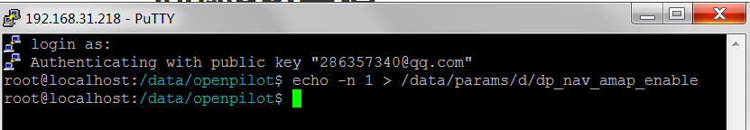

## 2.申请高德开发者资格

申请页面

https://console.amap.com/dev/id/choose

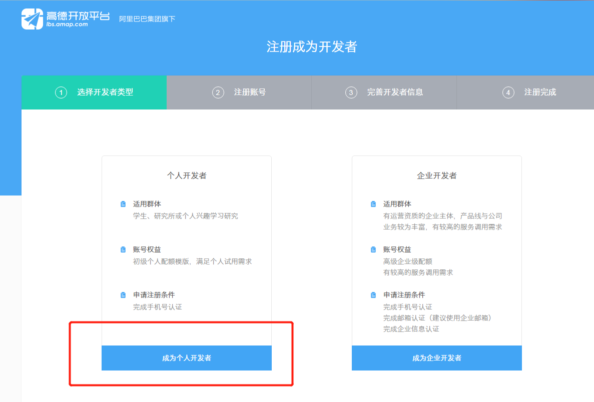

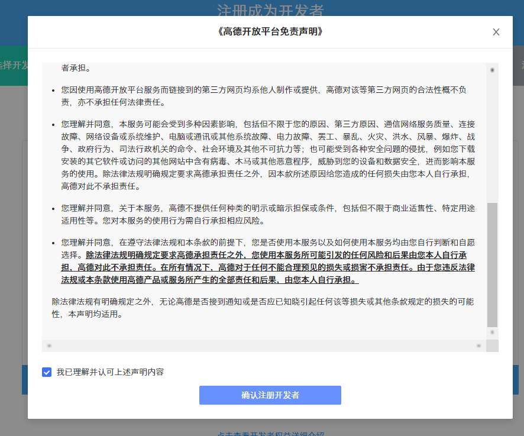

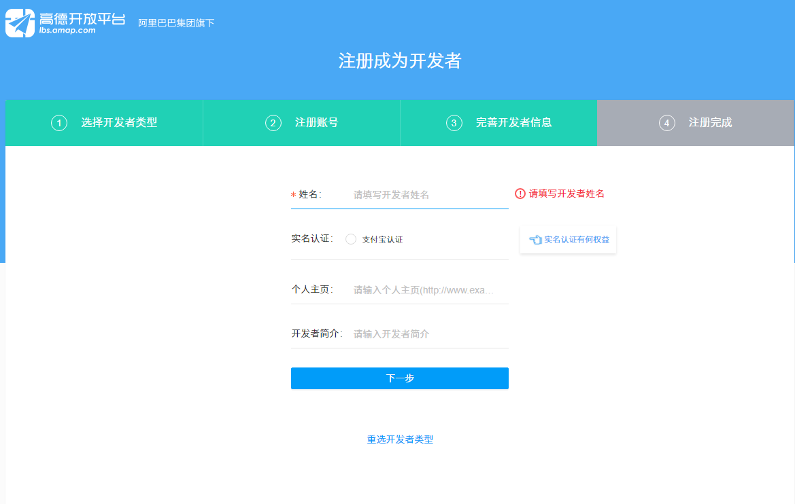

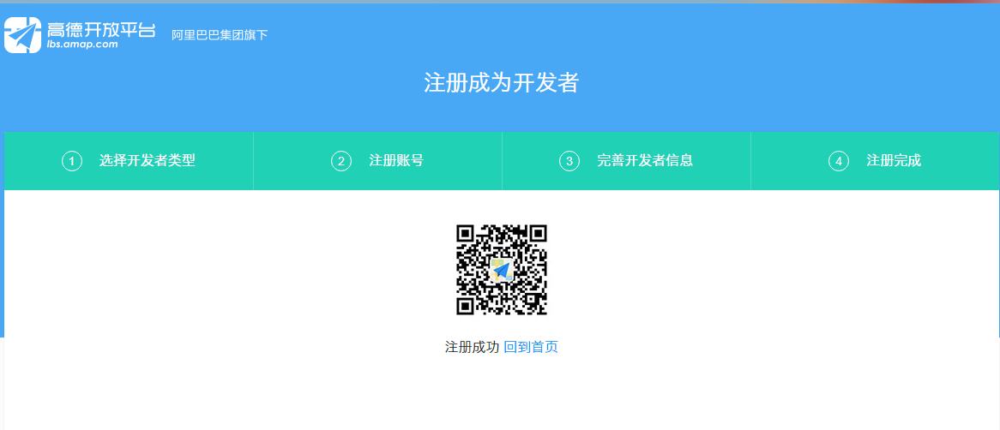

## 3.登陆控制台，申请key和安全秘钥

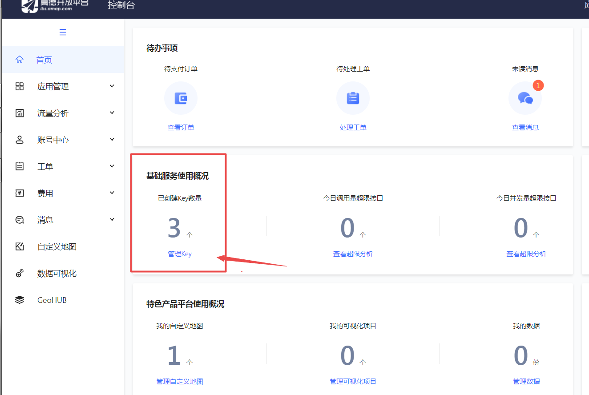

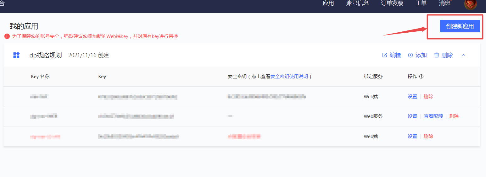

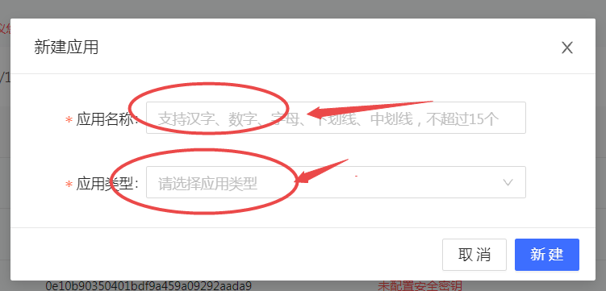

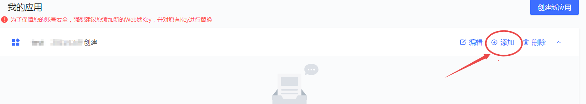

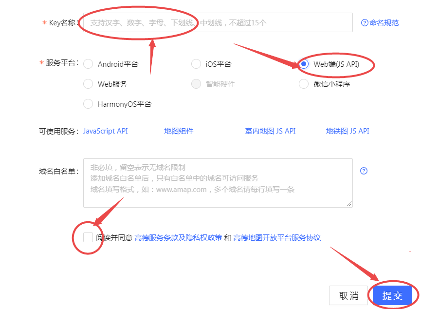

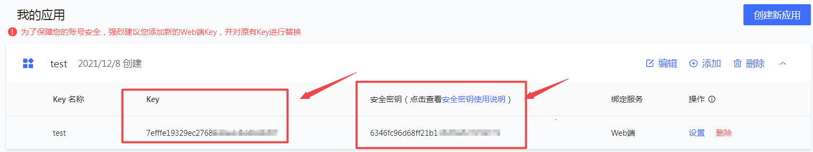

## 4.登陆设备（ip地址：8082）填写高德apikey和安全秘钥

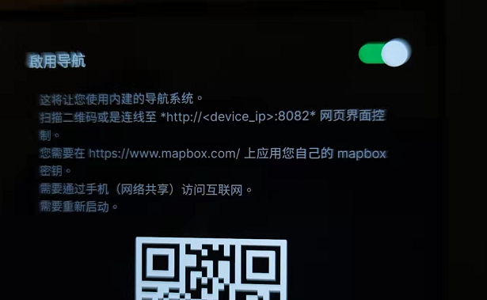

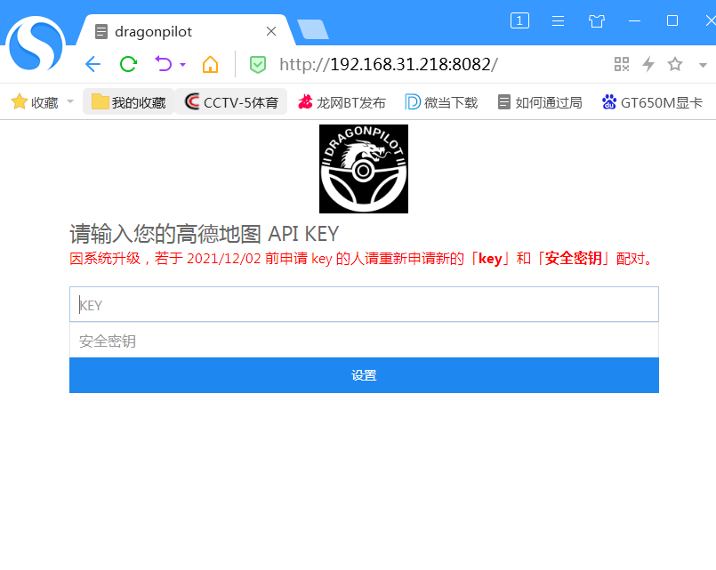

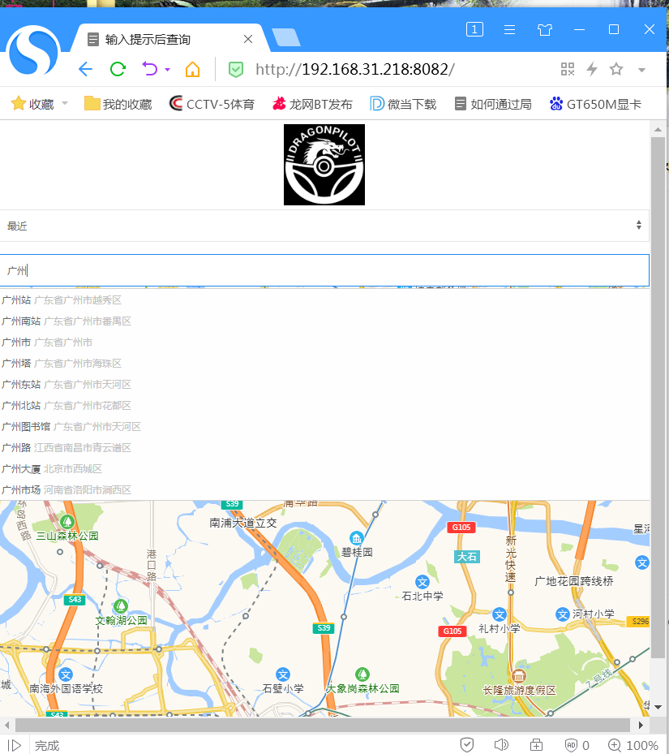

可以通过搜下拉菜单，保存（最近/住家/工作）地址到设备内，下次可以直接点击设备内对应地址，发起快捷导航

导航基于mapbox数据，有时候可能因为网络速度需要等待

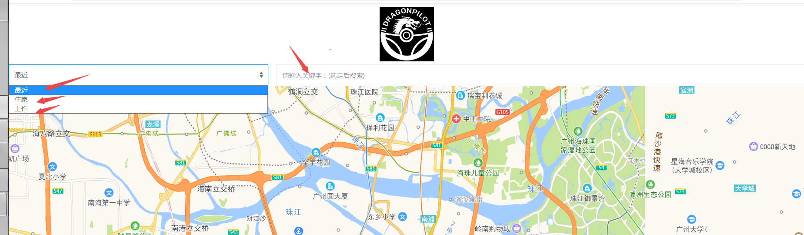

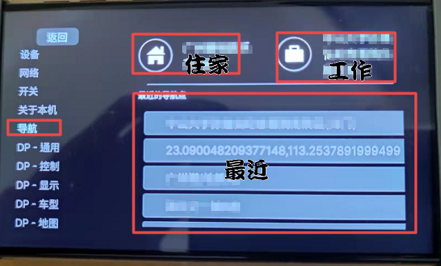