# 按照步骤一步一步安装comma two

安装教程中使用硬件主要是以下的硬件

### 如何购买 openpilot 硬件以及硬件之间的差别说明？

参考： [Openpilot 硬件购买篇](/cn/how_to_buy_openpilot.html)

#### 第二代硬件

名称|图片|链接
-|-|-
Harness connectors(黑色盒子是 harness)||-
Harness||-
Comma power v2||-

#### 第三代硬件

名称|图片|链接
-|-|-
Comma two(内置 Black panda)|

一般推荐安装位置为车辆前档玻璃正中，没有被后视镜遮挡的地方，如下示意图，不推荐随意移动可能影响车辆车道维持时候的位置

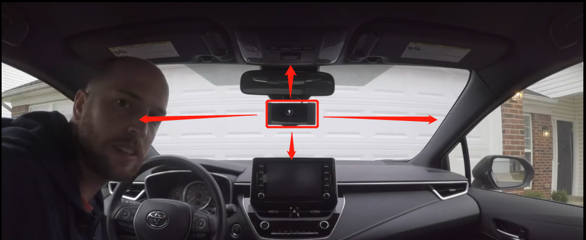

comma two很容易安装!按照视频指南或使用下面步骤一步一步的完成。

## 安装视频
丰田C2安装视频：https://www.bilibili.com/video/BV1ff4y1R7Hm

Harness在十代雅阁安装视频：https://www.bilibili.com/video/BV1VE411h7Kk

Harness混动雅阁安装是视频：https://www.bilibili.com/video/BV14K411T7

以下图片来自comma官方安装说明https://comma.ai/setup

翻译是根据意义和实际相关翻译的，如有不正确欢迎编辑修改

###### 步骤 1

#### 去除摄像头装饰盖

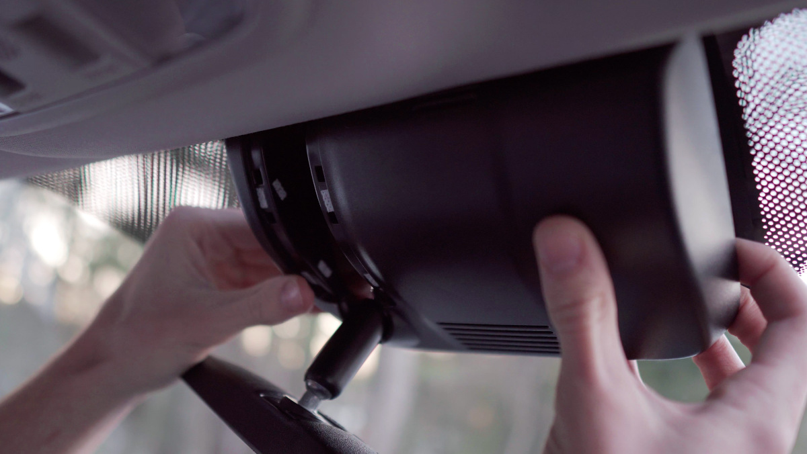

去除方法因车而异. 本田 Hondas一般只需要用力推就可以了（实际上还是用撬棍）. 丰田Toyotas 可能需要一个塑料撬棍. 国内的朋友可以寻找车友询问如何拆除自己的摄像头装饰盖

###### 步骤 2

#### 把 harness 转接线（Harness connectors）插入车辆的摄像头接口

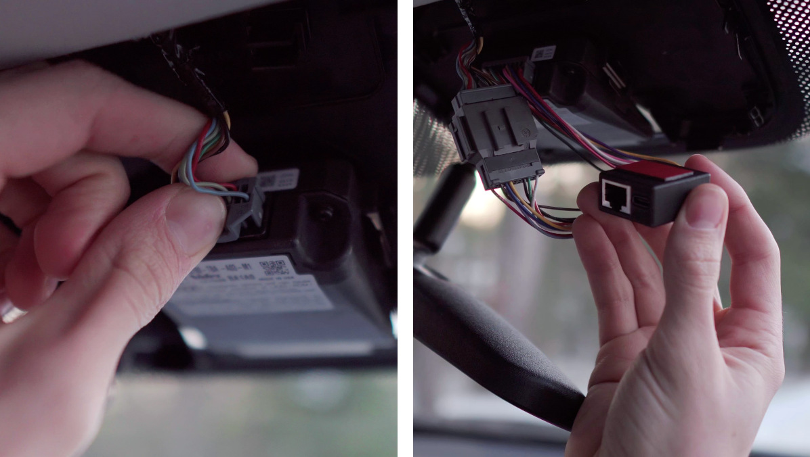

取下车辆LKAS 摄像头连接线插到harness的转接头上. 然后把harness另一端的接线插到LKAS摄像头的插口内

###### 步骤 3

####  将RJ45 连接线 和 USB-C 插入 harness上

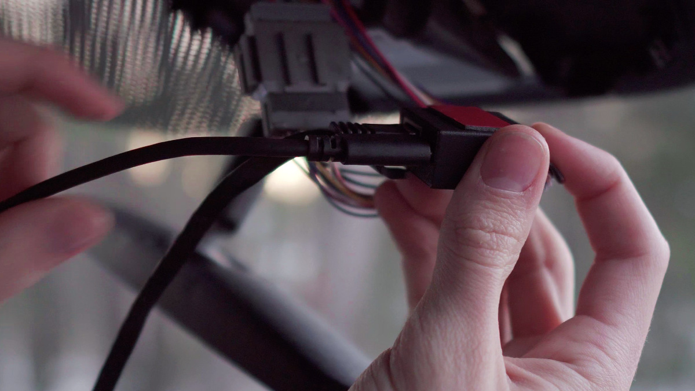

确定线材插入都很牢固

###### 步骤 4

#### 固定好 harness 和线束

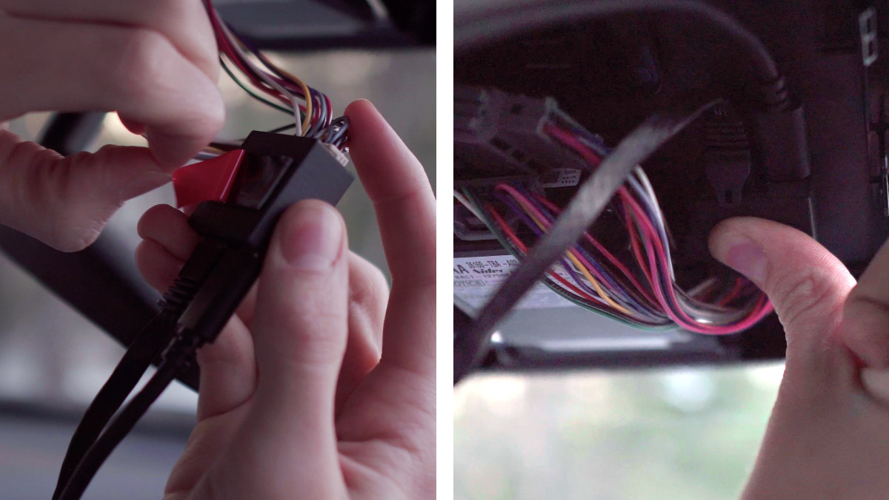

如果摄像内空间有空余就想办法把harness盒子和线束用双面胶固定在内部

###### 步骤 5

#### 将摄像头装饰盖板装好

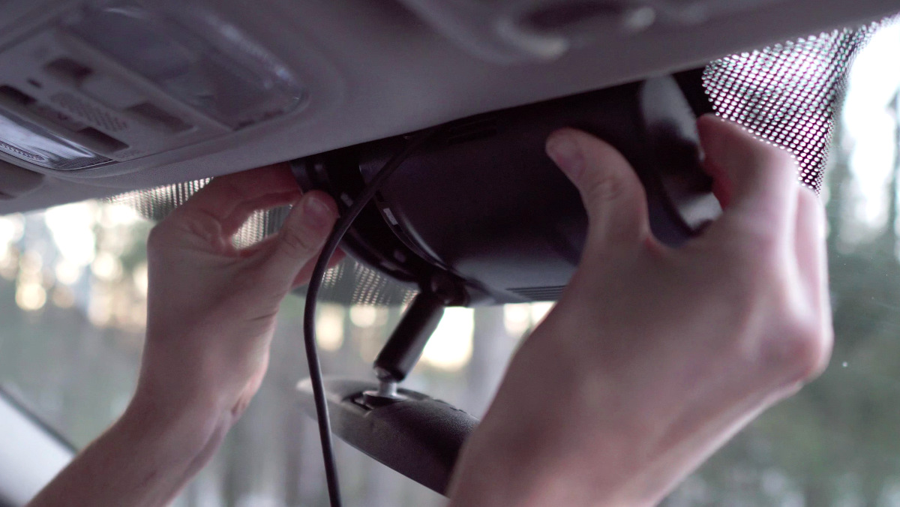

把 USB-C 线塞到靠近后视镜的右侧区域 ，调整好USB-C线材的出口

###### 步骤 6

#### 把 RJ45线材接到OBD-II接口

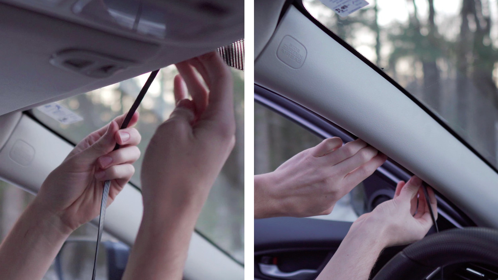

把RJ45接到OBD-II接口，一般OBD-II都是在方向盘的左下方向部分。小心的布线绕过你的A柱

###### 步骤 7

#### 把comma power V2 插到 OBD-II接口处

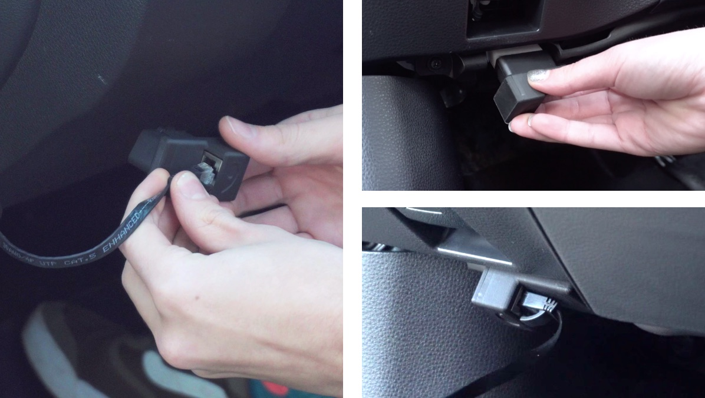

先把 RJ45 线材插到comma power V2 ，然后把 comma power V2 插入 OBD-II 接口

###### 步骤 8

#### 安装准备

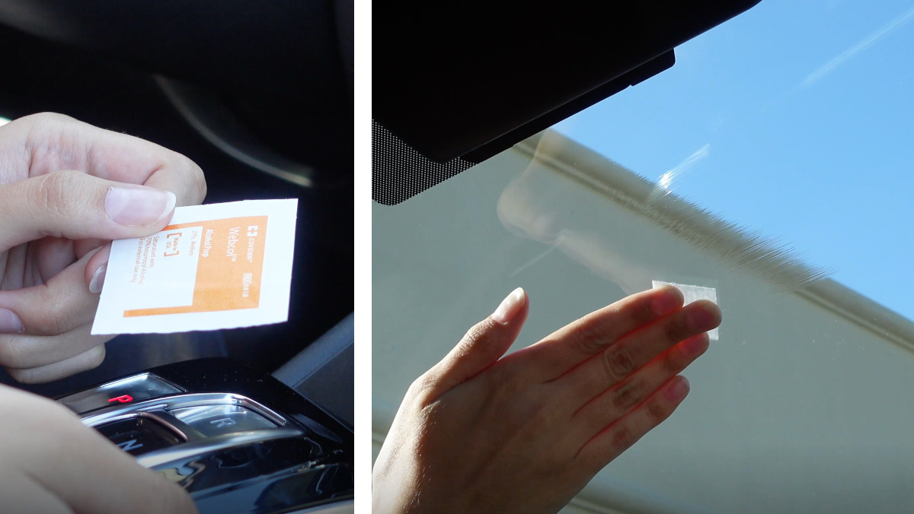

清洁你的前档玻璃

###### 步骤 9

#### 安装底座

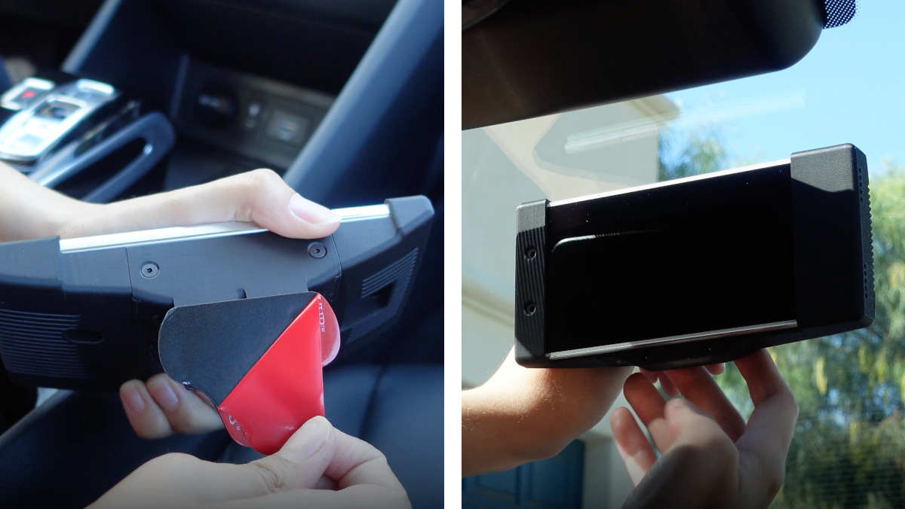

把comma two装在底座上.撕下底座上的3M贴纸. 将底座挂在挡风玻璃上. 确保司机能从驾驶位能看到comma two的屏幕. 轻轻的按压comma two的底座.

###### 步骤 10

#### 确定底座稳定

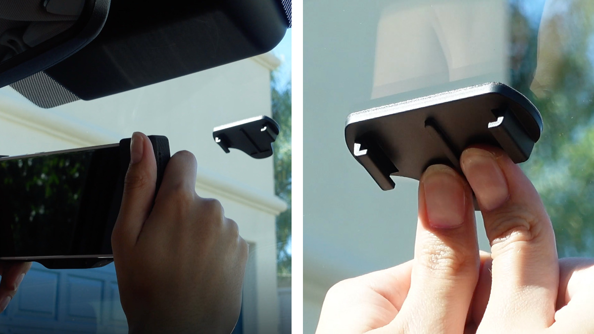

把comma two从底座上取下， 用力按住底座的中间部分, 然后用力按住底座边缘部分. 确保没有气泡残留在底座后面，让底座放置48小时 

###### 步骤 11

#### 把USB-C线插入comma two，并把comma two装到底座上

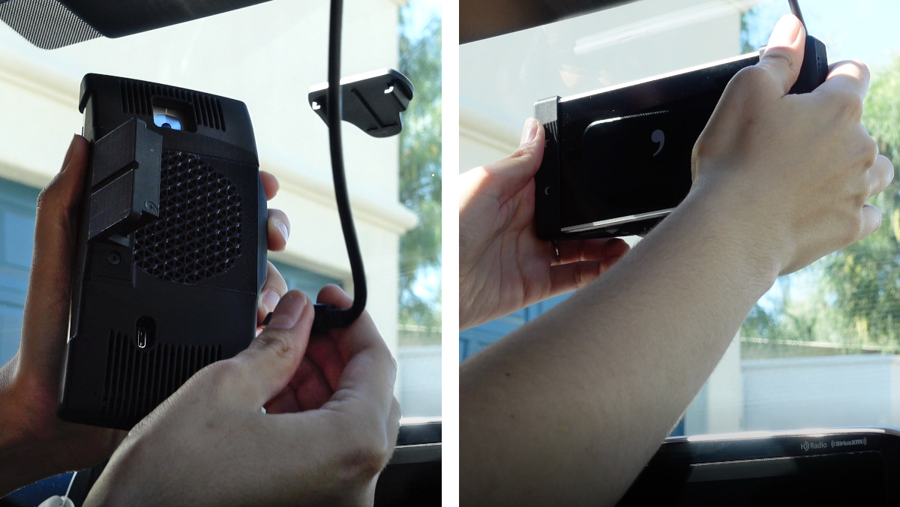

把USB-C线插到comma two背面接口. 保证comma two开机是线材是一直接好的. 把comma two装回底座，然后按照comma two上的引导进行使用

###### 步骤 12

#### 下载 comma connect app

可以下载comma connect app进行配对你的设备，查看你的行车记录之类相关的

###### 加入社区

有问题或者还有更多想学习的? 在Discord上有成千上万的知识渊博的社区成员。

[加入comma的Discord](https://discord.comma.ai/)

