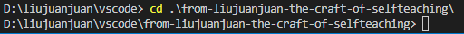
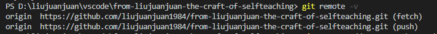
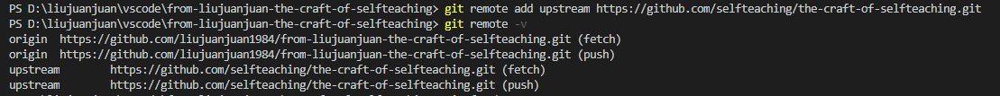
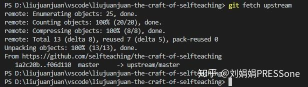
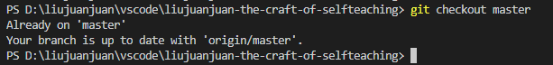
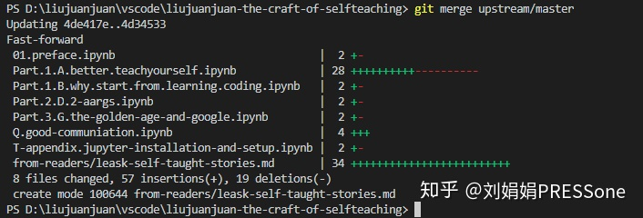
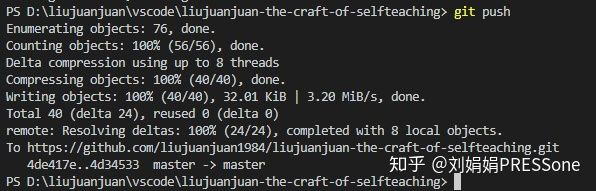

### Github进行fork后如何与原仓库同步

文章引用来源https://zhuanlan.zhihu.com/p/89607964

[](https://www.zhihu.com/people/qiaoanlu)

[刘娟娟PRESSone](https://www.zhihu.com/people/qiaoanlu)

Growth Hacker，一生的职业是学生

14 人赞同了该文章

实在是……有太多人同时在帮忙修订错别字或优化 xiaolai 的 `the-craft-of-selfteaching` 了。如果你提交的 pull request 未被接受且得到回复说：“重新fork”，其实是你遇到一个问题：

- 在你 fork 之后， xiaolai 的仓库又更新了；
- 但 github 不会自动帮你把 xiaolai 的仓库 同步给你 fork 后的仓库；
- 导致你提交 pull request 时的版本和 xiaolai 的版本不一致。

这个问题，用显得更“专业点”的说法，叫做：`Github进行fork后如何与原仓库同步`。那到底怎么做呢？

最省事的办法可能是：

- 在你fork的仓库setting页翻到最下方，然后delete这个仓库；
- 然后重新fork xiaolai 的仓库，并 git clone 到你的本地。

有时候，你需要用到这个省事的办法，比如 xiaolai 的仓库再次整理了 commit 。但在更多情况下，删掉自己fork的库，应该是你的最后选择，而不应该是首选。

和很多人一起向 xiaolai 提交 pull request，这实在是一个反复练习 `merge` （中文说法：合并，或版本合并）的机会。毫不夸张地讲，版本管理是软件工程极其重要的规范，也是极其基础的必备技能。而 `merge` 则是版本管理中最必须也最常用的场景。

那要不然，就多练练？以下是傻瓜版操作步骤，还细心配了截图，保管你从 0 也能上手。至于原理嘛，慢慢再搞懂吧。

### merge前的设定

**step 1、**进入到本地仓库的目录。

下面所有操作，如无特别说明，都是在你的本地仓库的目录下操作。比如我的本地仓库为`/from-liujuanjuan-the-craft-of-selfteaching`



**step 2、**执行命令 `git remote -v` 查看你的远程仓库的路径：



如果只有上面2行，说明你未设置 `upstream` （中文叫：上游代码库）。一般情况下，设置好一次 `upstream` 后就无需重复设置。

**step 3、**执行命令 `git remote add upstream https://github.com/selfteaching/the-craft-of-selfteaching.git` 把 xiaolai 的仓库设置为你的 `upstream` 。这个命令执行后，没有任何返回信息；所以再次执行命令 `git remote -v` 检查是否成功。



**step 4、**执行命令 `git status` 检查本地是否有未提交的修改。如果有，则把你本地的有效修改，先从本地仓库推送到你的github仓库。最后再执行一次 `git status` 检查本地已无未提交的修改。

```
git add -A` 或者 `git add filename` `git commit -m "your note"` `git push origin master``git status
```

注1：这一步作为新手，建议严格执行，是为了避免大量无效修改或文本冲突带来的更复杂局面。

注2：如果你已经在fork后的仓库提交了大量对 xiaolai 的仓库并没有价值的修改，那么想要pull request，还是重新回到本文最初的“最省事办法”吧。

### merge 的关键命令

以下操作紧接着上面的步骤。

**step 5、**执行命令 `git fetch upstream` 抓取 xiaolai 原仓库的更新：



**step 6、**执行命令 `git checkout master` 切换到 master 分支：



**step 7、**执行命令 `git merge upstream/master` 合并远程的master分支：



**step 8、**执行命令 `git push` 把本地仓库向github仓库（你fork到自己名下的仓库）推送修改

如果担心自己不小心改了哪里，可以再次执行命令 `git status` 检查哪些文件有变化。这个操作仅是检查，不会改变任何状态，放心用。



现在你已经解决了fork的仓库和原仓库版本不一致的问题。可以放心向 xiaolai 发起 pull request 了。如果以上操作你花了不少时间，而 xiaolai 的仓库 又恰好更新了。很好，一次新的练习机会来了……

**补记：**这份笔记最初整理于2019年3月。或许因为我平时git操作仅是简单的修改新增，与其它仓库协作少，于是这种上游仓库的设置与同步相关指令需要用时，还是得搜到这篇笔记来看。那就发出来，或许也能帮到其他人吧~