如何在一加3T手机的eon上安装DP0.8.4版本
------

注意：安装0.8.4版本必须使用SSH方式，并且需要使用个人私钥登录eon。登录ssh方式请参考以下链接

[使用 Putty SSH 切换 openpilot 分支版本](how_to_change_openpilot_fork_on_windows.md)

[OP设置SSH-绑定GitHub账户](how_to_setup_github_ssh.md)


1. SSH登录eon，手动安装并且切换到 dragonpilot 0.8.4 分支

```
cd /data/ && rm -rf openpilot && cd /data/ && git clone https://github.com.cnpmjs.org/dragonpilot-community/dragonpilot.git openpilot -b 0.8.4 --depth=1
```
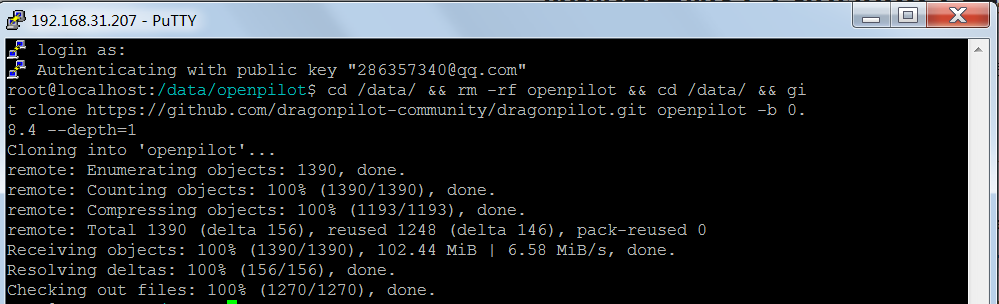

2. 安装并切换到dp0.8.4分支后，在 ssh界面下，粘贴以下代码

```
cd /data/openpilot/scripts/ && ./oneplus_update_neos.sh
```
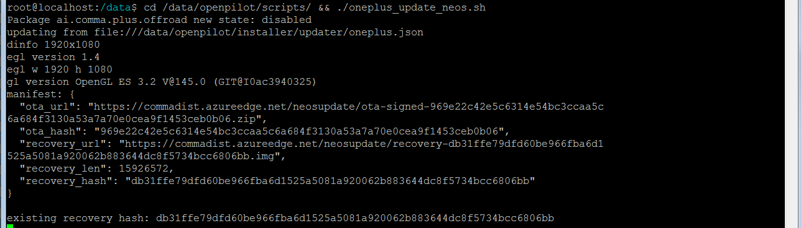
3. 设备会出现升级提示，点击continue，进行继续下载，下载完成后会出现Android机器人升级画面，等待升级完成后进行重启

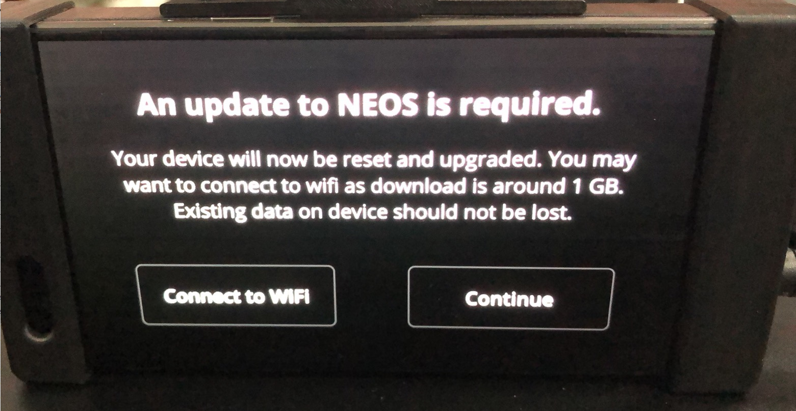
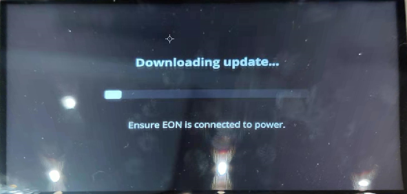
3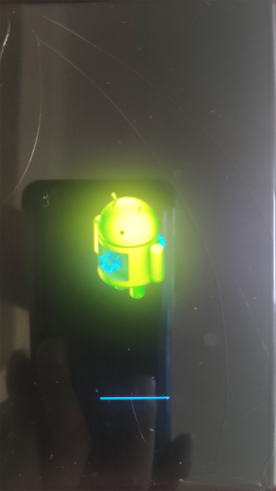

4. 重启后进入fastboot模式，在 fastboot 模式下，用音量鍵上下选择 Recovery mode 再按下电源键进行确认

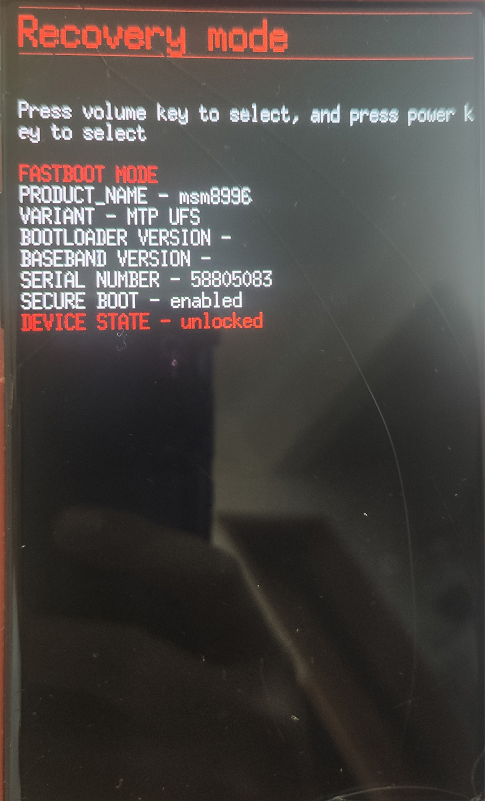

5. 在 Recovery mode，按照如图顺序点击选择 `apply update` -> `Choose from emulated` -> `0/` -> `update.zip` -> 等待出现Android机器人升级完成后点击 `Reboot system now`

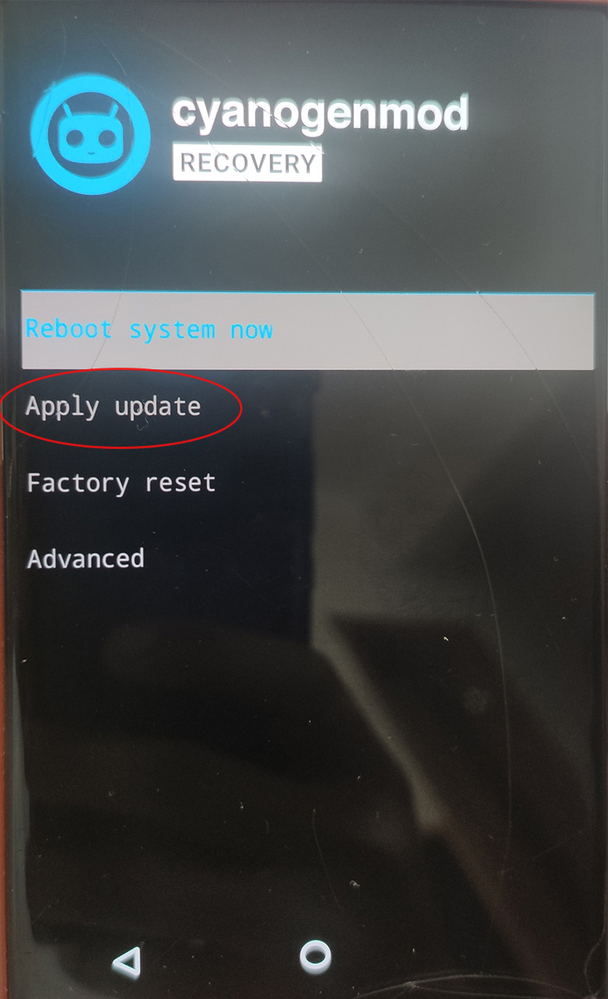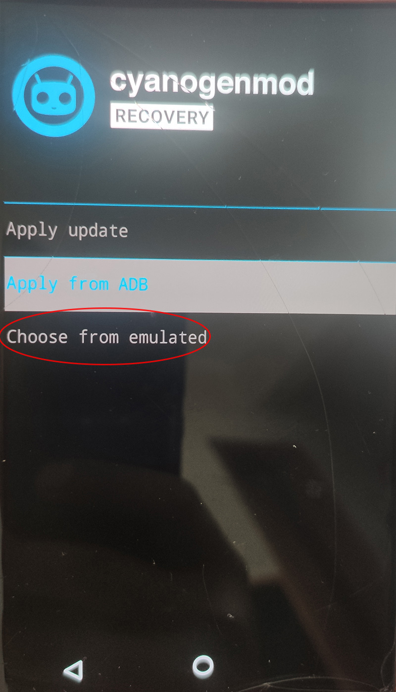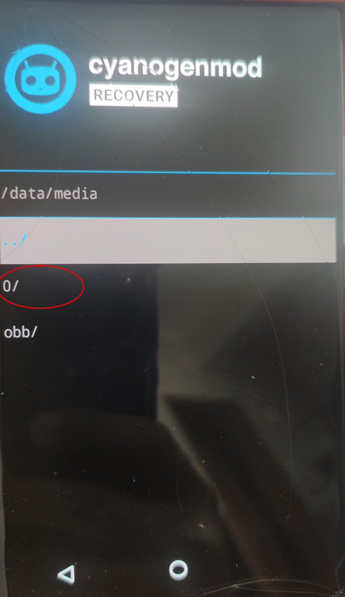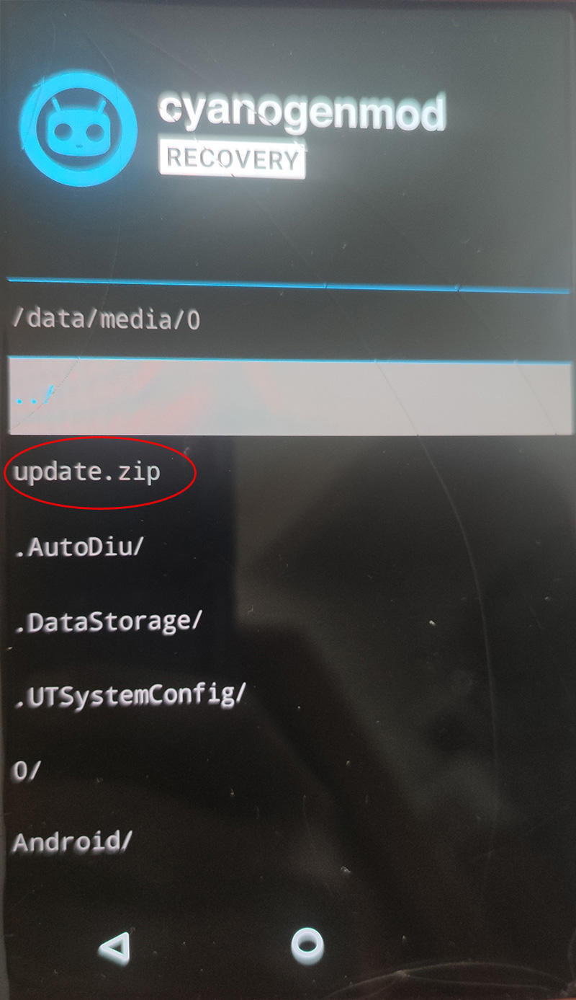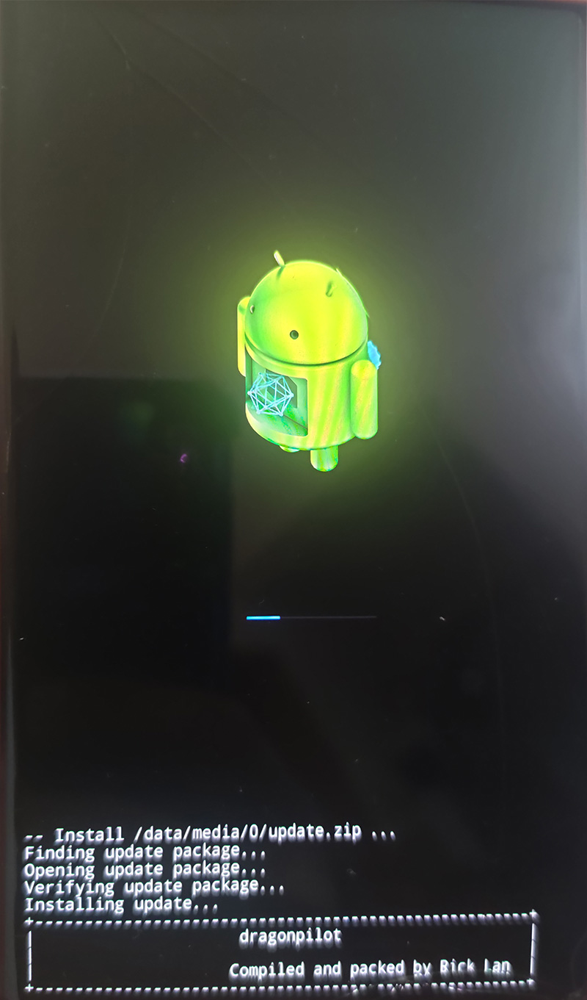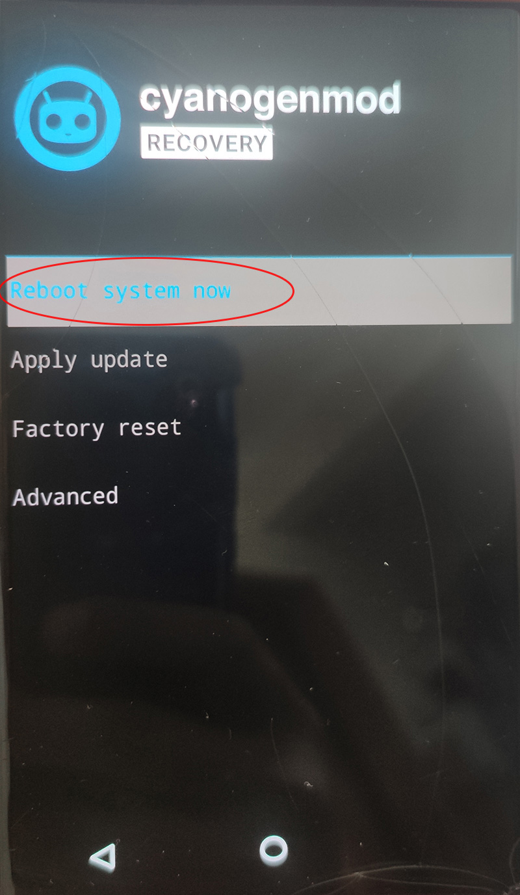

6. 重启后可以进入 openpilot 的界面，等待进度条走完（可能需要等待20-30分钟，可以自行通过ssh里面tmux at查看进度）就可以成功进入DP0.8.4。

   注意：如果出现点击屏幕沒有反应情况，请重启设备即可

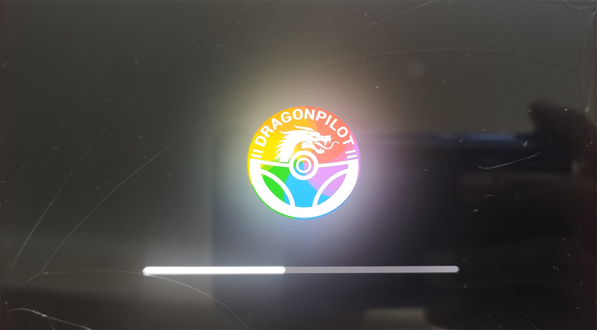

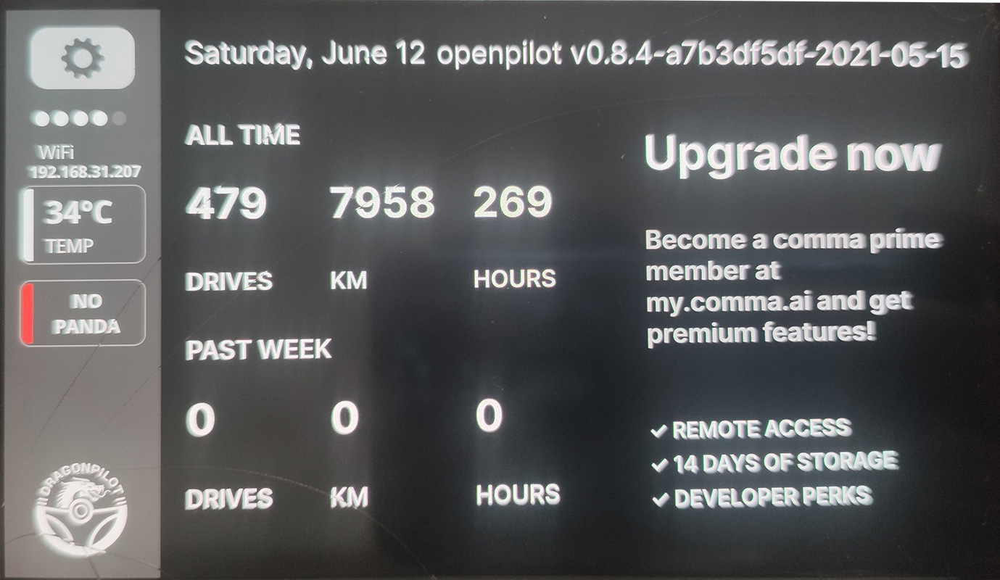

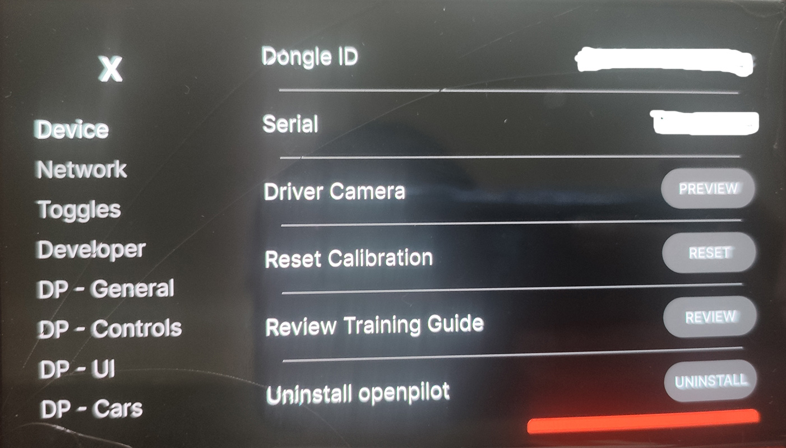

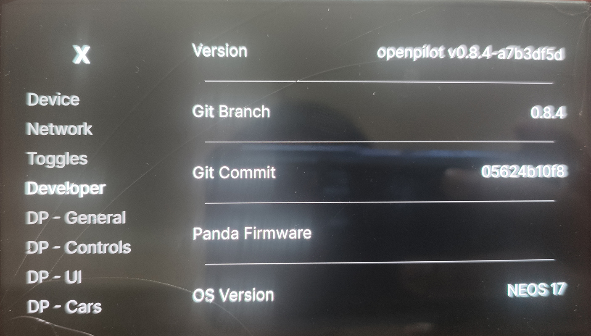