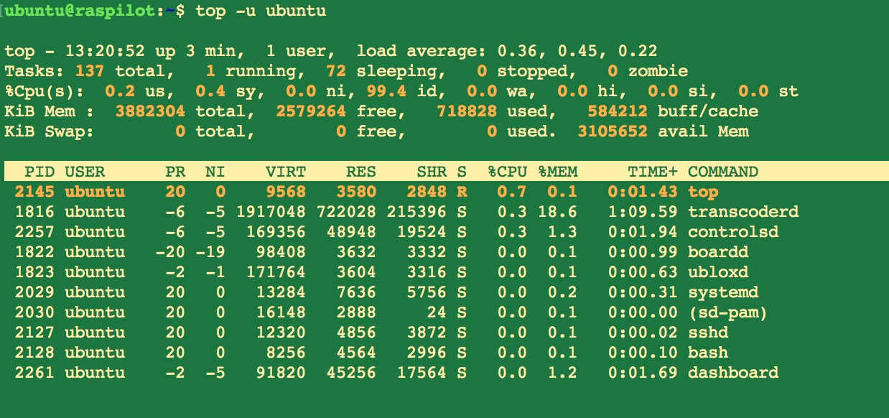
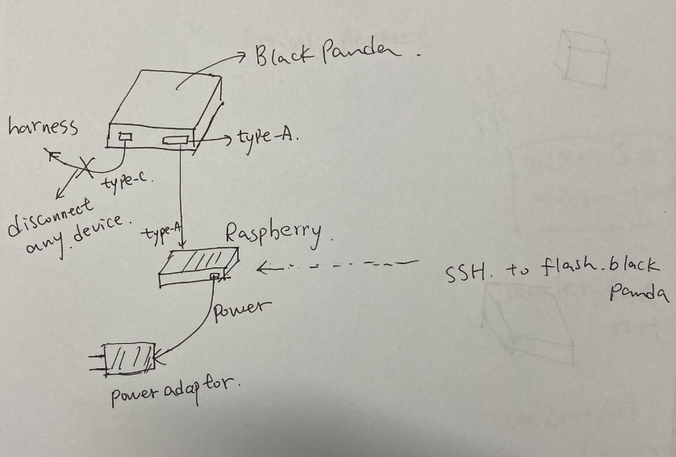
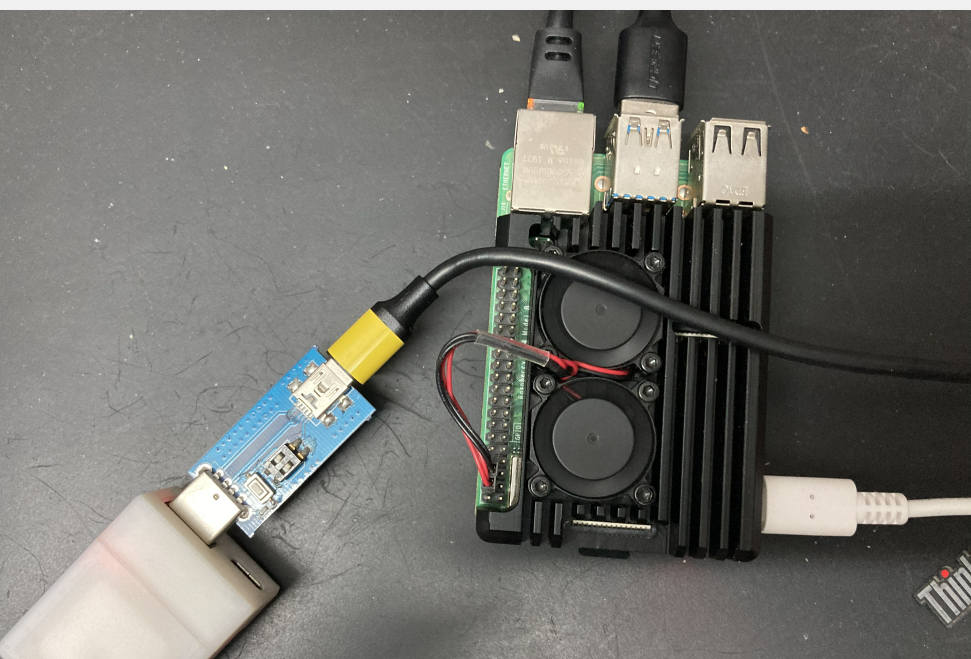
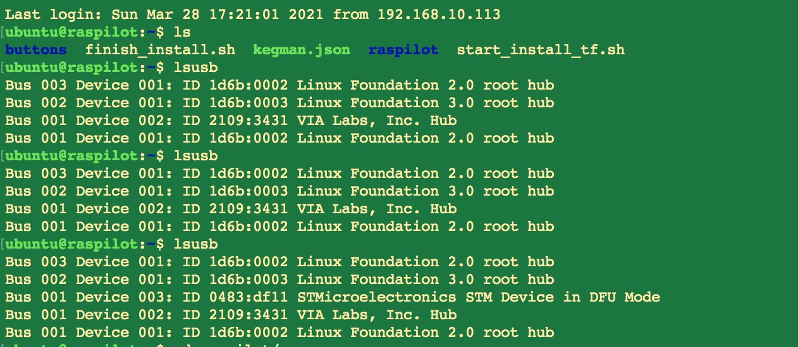
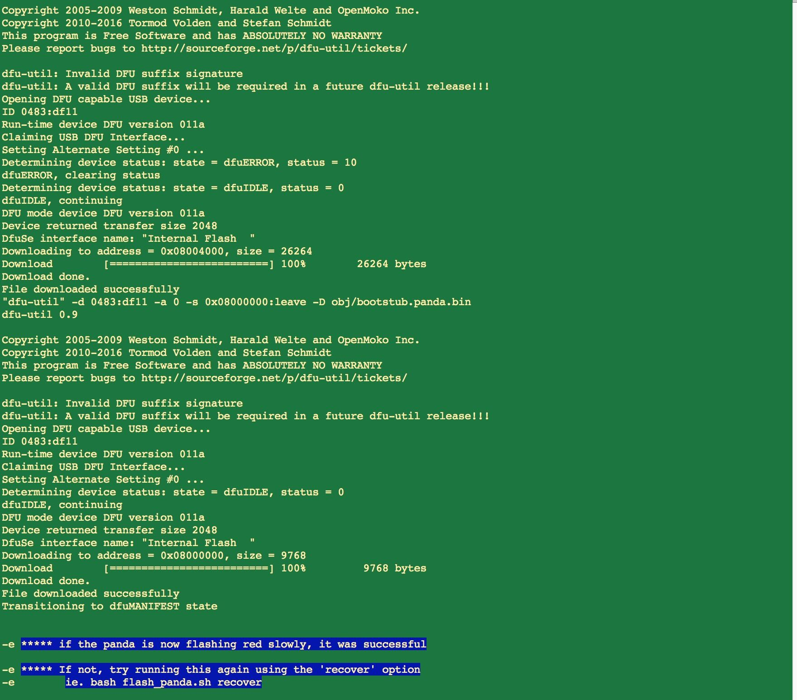
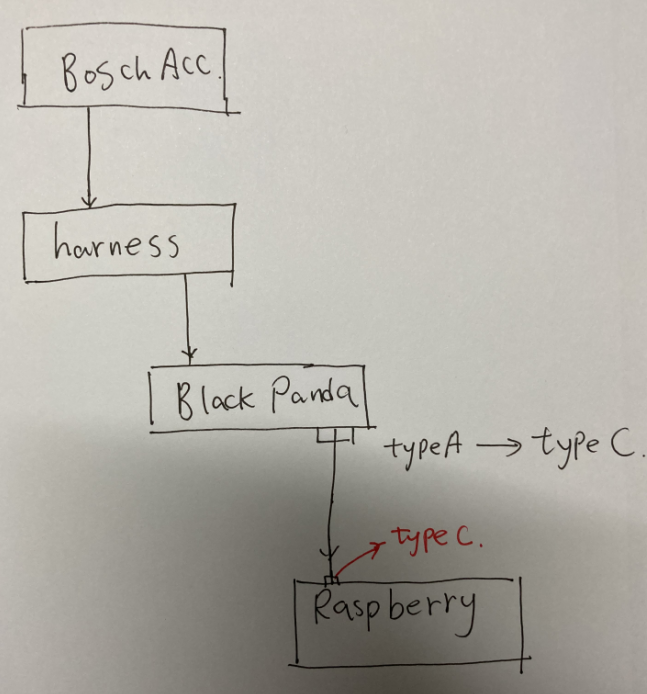
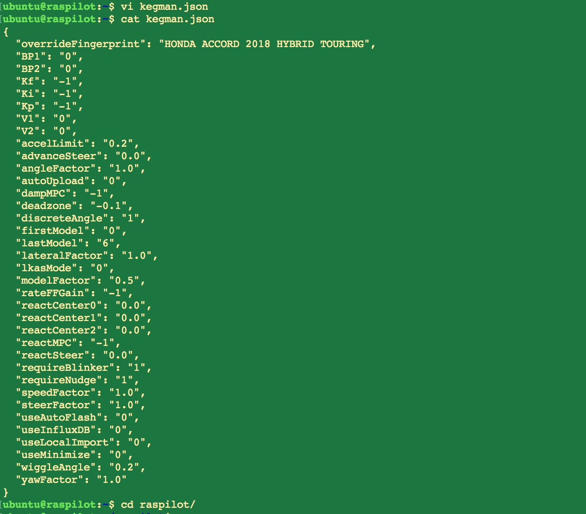

#Raspilot 安装说明 

感谢豆友@Cnlinuxman提供

提示：Raspilot暂时只能用博世套件，文章车型为中国版雅阁混动，请注意

###固件烧写

1. 下载固件:

   > 此固件集成了ubuntu 和 raspilot.这样就很省事多了. 
   >
   > Raspilot 的Discord 服务器，更多消息讨论都在上面
   >
   > Raspilot Discord server https://discord.gg/MMGCVh9
   >
   > 感谢 Gernby(Discord ID:Gernby#5142) 和 two70(Discord ID:two70#5504)
   >
   > ~~~html
   > https://drive.google.com/drive/folders/1rlyDdFtGRBfOfC7dyWBiVDFcSTHWrUb5?usp=sharing
   > 
   > ~~~
   >
   > 

2. 系统烧录

   > 下载 Balena Etcher 对应版本
   >
   > ~~~html
   > https://www.balena.io/etcher/
   > ~~~
   >
   > 

### 树莓派配置无线网络

1. 树莓派通过有线连接你的路由器，

   > ~~~text
   > ssh ubuntu@raspberry ip
   > ~~~
   >
   > 

   > account name:ubuntu  
   > passwd:raspilot
   >
   > 检查ubuntu 进程
   >
   > ~~~text
   > tpp -u ubuntu
   > ~~~
   >
   > 

2. 打开手机的热点，为raspilot 在车上提供wifi,便于ssh (图形化设置)

   > ~~~text
   > sudo nmtui
   > ~~~
   >
   > 

### Flash Black Panda

1. 这个环节很重要，很多人被卡在这里.这个是Discord 上的刷黑熊的方法：

   > 连接如图
   >
   > 
   >
   > 

   > Discord 网友提供的方法
   >
   > ~~~text
   > 1. Disconnect Black Panda and Pi from everything.
   > 2. Connect Black Panda to Pi using USB A to A. (插到 Pi 的usb 3.0 口)
   > 3. Connect Pi to a power source (这个在家，就把Pi 的Type C 连接电源吧)
   > 4. Once Pi is booted up, SSH into it and run `sudo sh ~/raspilot/flash_panda.sh recover`
   > 5. Let it sit and then Black Panda is flashing slowly in Red!
   > ~~~
   >
   > 

2. 我按照上面的方法,没有成功(got Error74)，如果不行，可以参考我的方法（如果刷成功了，black panda 会红灯呼吸亮）

   > 我的方法：
   >
   > 我手上刚好有个panda paw .我就利用它使我的black panda 进入DFU 模式,lussb 可以查看当前连接的usb 情况,如果列表里有 STM Device in DFU Mode 这一行信息，说明Black Panda 被识别了
   >
   > ~~~text
   > lsusb
   > ~~~
   >
   > 
   >
   > 下面就可以刷Black Panda
   >
   > ~~~text
   > sudo sh ~/raspilot/flash_panda.sh recover
   > ~~~
   >
   > 如图状态，说明已成功flash black panda
   >
   > 

###上车测试

1. 上车连接raspilot

   > 1. 物理连接如图
   >
   > 
   >
   > 2. 启动车辆, ssh 你的 Raspilot,把你手机热点打开，提供wifi 给 Raspilot
   >
   > ~~~text
   > ssh ubuntu@raspilot ip
   > cd raspilot
   > 
   > bash model.sh   
   >   //这里需要等2 mins ,如果不动了 按 ctrol +c  中断
   > ~~~
   >
   > 3. 编辑 kegman.json 文件，插入"overrideFingerprint": "HONDA ACCORD 2018 HYBRID TOURING"
   >    (这里仅针混动雅阁,其他车型 可以联系Gernby)
   >
   >    ~~~text 
   >    cd ..
   >    
   >    vim kegman.json 
   >    ~~~
   >
   >    

### 上路校准摄像头

1. 下面可以上路Calibrate 

   > 尽量找条 比较直, 划线明显的道路来校准摄像头.行驶个3km 左右吧。找个地方停车，熄火，重新启动汽车.
   >
   > 等待LKAS 图标显示，如果LKAS图标出来，此时你能感觉到方向盘有点重，说明车子已经激活了车道保持了.
   >
   > 我建议城市驾驶，还是把车道保持关了，不然车道保持和你抢方向盘.
   >
   > 如果你长时间使用Openpilot ,刚开始有点不习惯.车道保持和ACC 不是关联的，单独方向盘按键来开/关.这个和Gernby 沟通过，他不想这样做 hoho,

2. 祝好运 Enjoy