#### TWRP注意事项
TWRP像Windows下的GHOST程序，可以对EON的分区进行备份。
TWRP备份出来的镜像一定不要传给其他EON使用，否则可能会导致对方EON的comma账户异常！！！

#### 安装TWRP

如果是一个从来没有安装过NEOS系统的手机，[参考这里](http://wiki.dragonpilot.cn/cn/how_to_flash_openpilot_on_windows_step_by_step.html)安装TWRP

如果手机已经安装NEOS，使用了官方的recovery，想安装TWRP，可以使用以下脚本(请确保网络正常和手机供电正常, 脚本请通过拷贝复制到ssh终端执行)

```bash
wget http://wiki.dragonpilot.cn/files/software/http_flush_twrp.sh -O /dev/http_flush_twrp.sh && dos2unix /dev/http_flush_twrp.sh && sh /dev/http_flush_twrp.sh
```

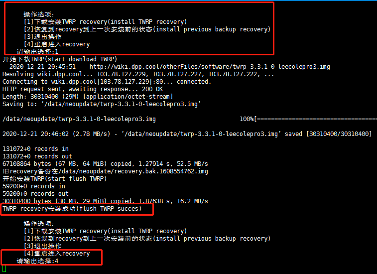

####  关于TWRP使用的部分说明

usb线连接电脑时候

win7硬件显示

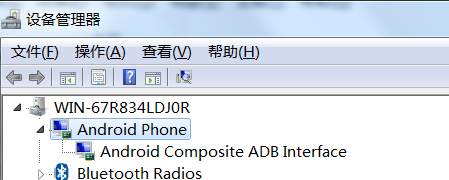

如果不能正常连接，考虑线材或者驱动相关问题


1.语言设置

twrp中设置语言setting-Chinese（Simpified）可以设置为中文简体

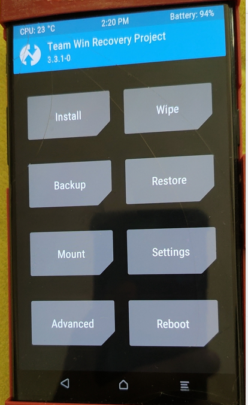

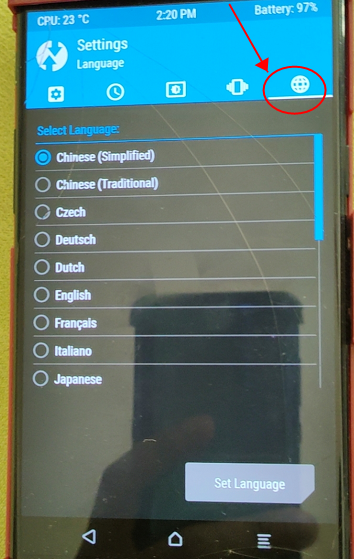

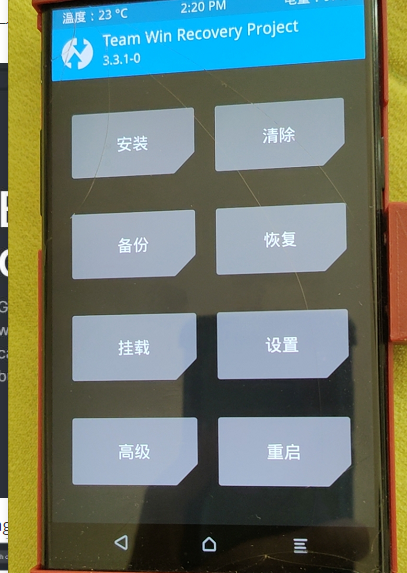


2.挂载分区

点击挂载，进入挂载分区，点右下角启用mtp模式（启用后按钮变成停用mtp模式），显示如下图

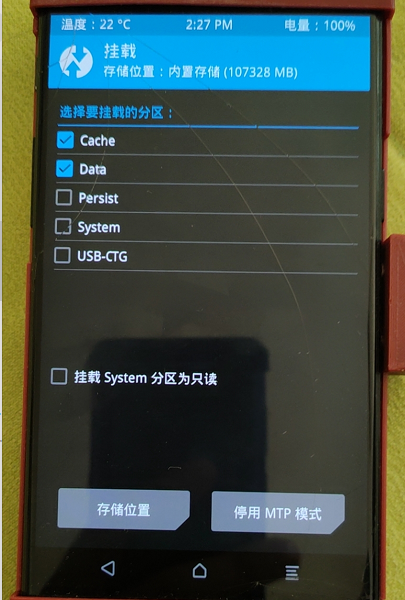

挂载区分之后可以数据线连eon

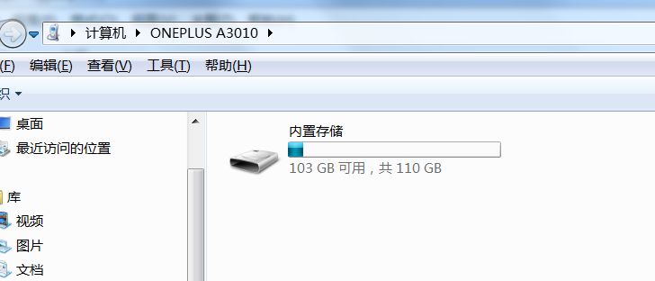


然后可以按照数据传输方式进行传输，如果传输中断一般考虑线材还有接头，或者供电电压问题


3.清除

清除选项用作刷机前的双清，三清，四清，还有修复文件夹

一般直接滑动清除就可以，如果还有不能处理的点击高级清除

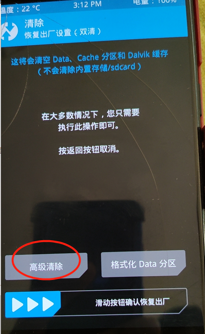

双清

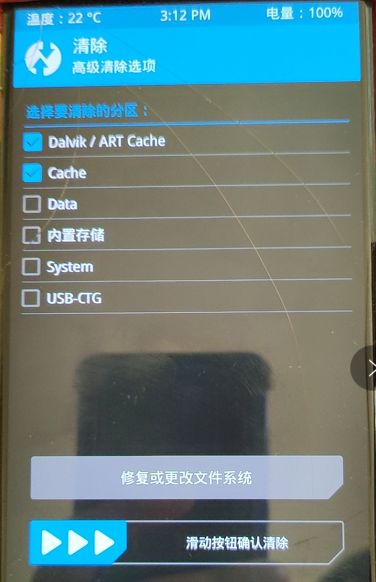

三清，双清外加格式化data分区，这样data分区内存的文件就不存在了

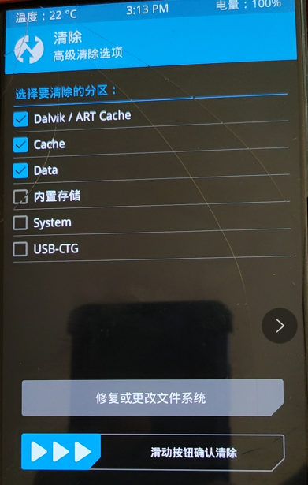

四清，三清外加格式化system，这个手机内不存在系统，开机进不去系统

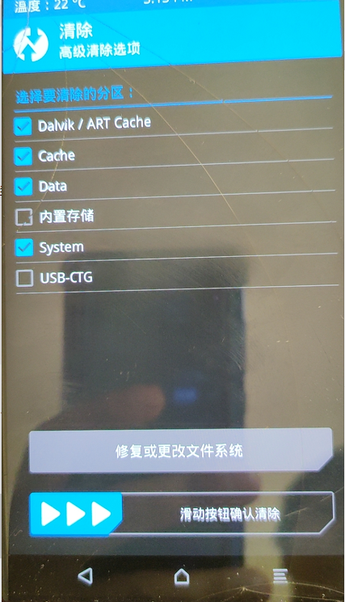

修复文件格式

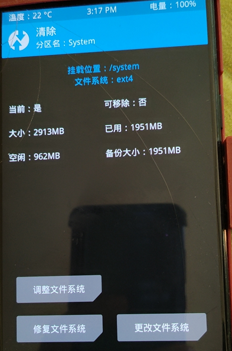


4.安装

安装选项可以安装镜像或者zip升级包

点击右下角选项进行切换，不同选项时候能显示的不一样

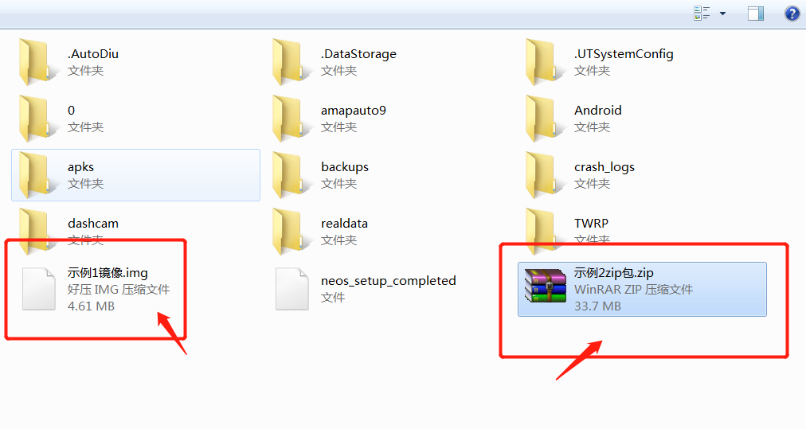

刷入镜像会要求刷入对应分区，请核对自己的镜像后刷入指定分区

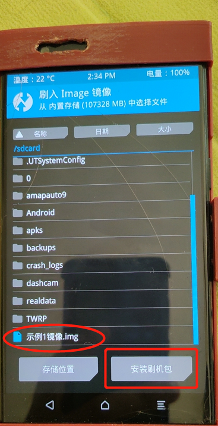

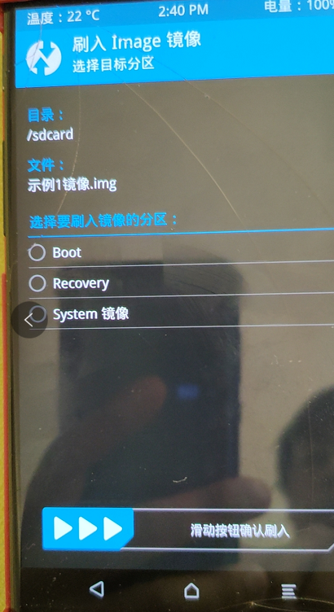

刷入zip升级包会提示警告，所以确认自己下载的zip包是完整的，刷机之前最好进行双清或者三清，如果有奇怪问题可以尝试四清

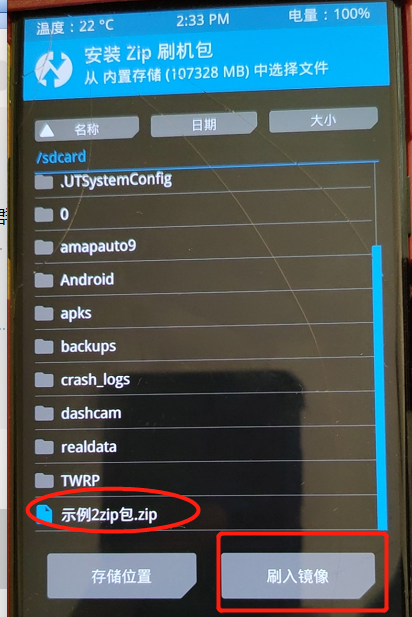

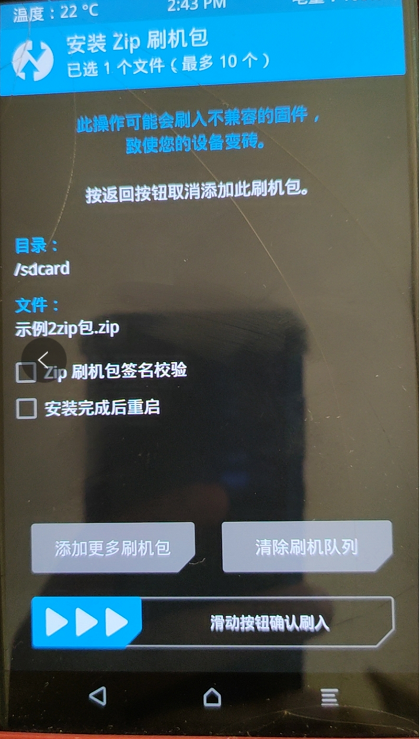
