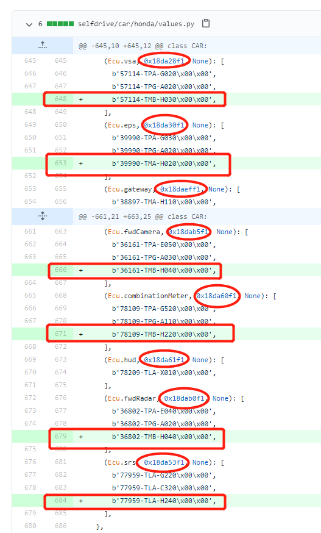

## 抓取车辆指纹2.0

基于ECU固件版本的指纹识别车型，就是车辆指纹2.0

OpenPilot 0.70之后，开始使用基于ECU固件版本的指纹识别 识别当前连接的什么车型（/data/openpilot/selfdrive/car/{汽车厂商}/values.py 文件中的指纹信息列表）。

**获取车辆指纹2.0需要连接OBDⅡ接口**

1. 汽车未启动情况下，使用电脑连接到 EON 并打开 SSH 窗口[1]：
```bash
killall tmux
```
2. 启动车辆，在 SSH 窗口[1]输入
```bash
cd /data/openpilot/selfdrive/boardd
./boardd
```
3. 新打开一个 SSH 窗口[2]输入
```bash
cd /data/openpilot/selfdrive/car/
python fw_versions.py --scan
```
4. 等待命令执行结束
```bash
Found FW versions
{
    ...
}
```
以上内容就是你的车辆指纹2.0

将车辆指纹2.0对应values.py 文件车型和硬件位置填入

以CRV混动2019中国版为例，获得车辆指纹2.0如下

Found FW versions
{
  (Ecu.unknown, 0x18da01f1, None): [b'1K101-5RD-H030\x00\x00']
  (Ecu.unknown, 0x18da02f1, None): [b'1K021-5RD-H020\x00\x00']
  (Ecu.unknown, 0x18da0ef1, None): [b'37805-5TZ-H660\x00\x00']
  (Ecu.unknown, 0x18da0bf1, None): [b'54008-TMB-H510\x00\x00']
  (Ecu.unknown, 0x18da1cf1, None): [b'24851-5WR-A010\x00\x00']
  (Ecu.unknown, 0x18da28f1, None): [b'57114-TMB-H030\x00\x00']
  (Ecu.unknown, 0x18da2af1, None): [b'46114-TMB-H950\x00\x00']
  (Ecu.unknown, 0x18da30f1, None): [b'39990-TMA-H020\x00\x00']
  (Ecu.unknown, 0x18dab5f1, None): [b'36161-TMB-H040\x00\x00']
  (Ecu.unknown, 0x18daeff1, None): [b'38897-TMA-H110\x00\x00']
  (Ecu.unknown, 0x18da53f1, None): [b'77959-TLA-H240\x00\x00']
  (Ecu.unknown, 0x18da60f1, None): [b'78109-TMB-H220\x00\x00']
  (Ecu.unknown, 0x18dab0f1, None): [b'36802-TMB-H040\x00\x00']
}

在/data/openpilot/selfdrive/car/honda/values.py内

逐个对应增加，每个对应数值为**0x18daxxxx**的，按照规则添加到对应位置



如需将车辆指纹2.0提交给官方
   需要参考https://github.com/commaai/openpilot/wiki/Fingerprinting