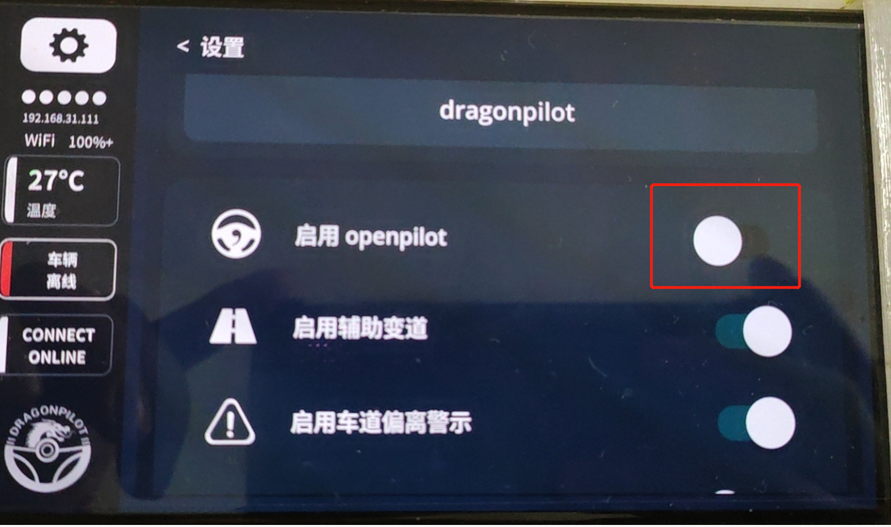
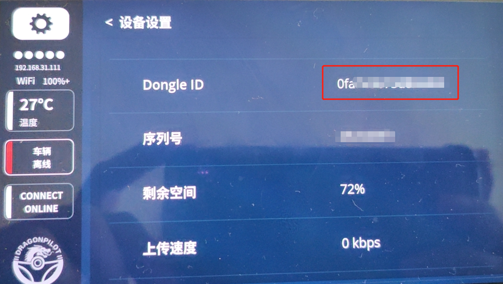
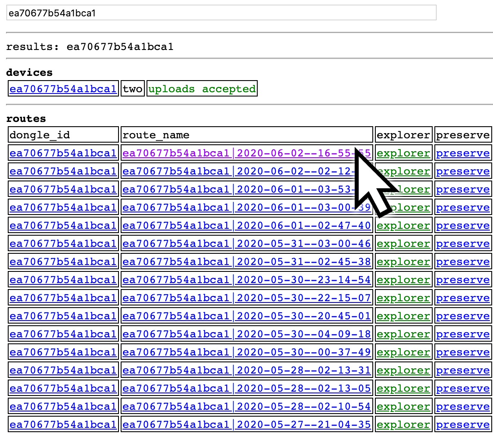
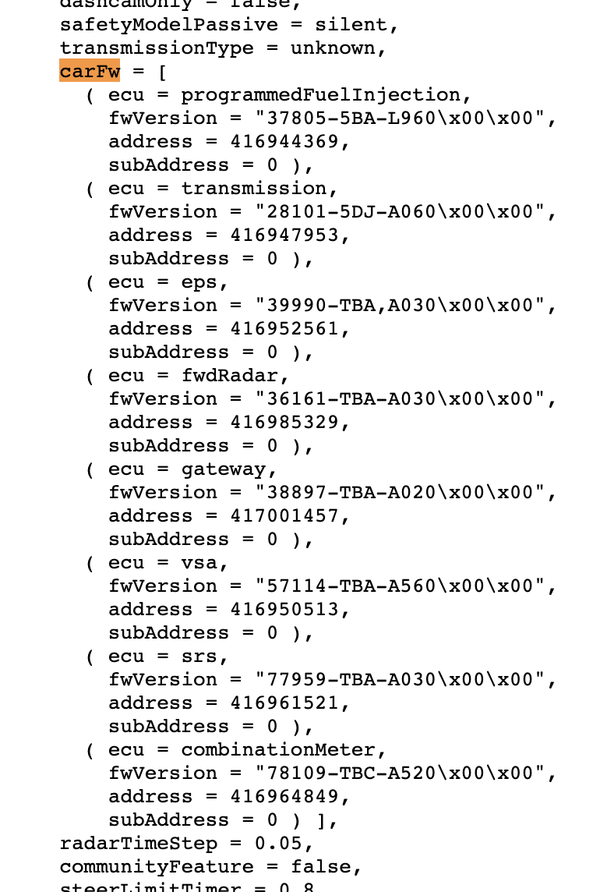
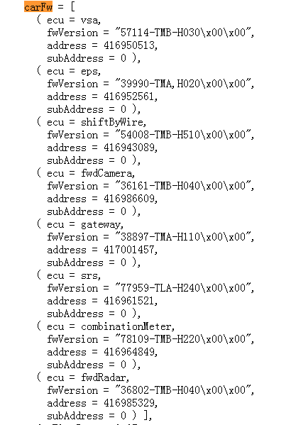
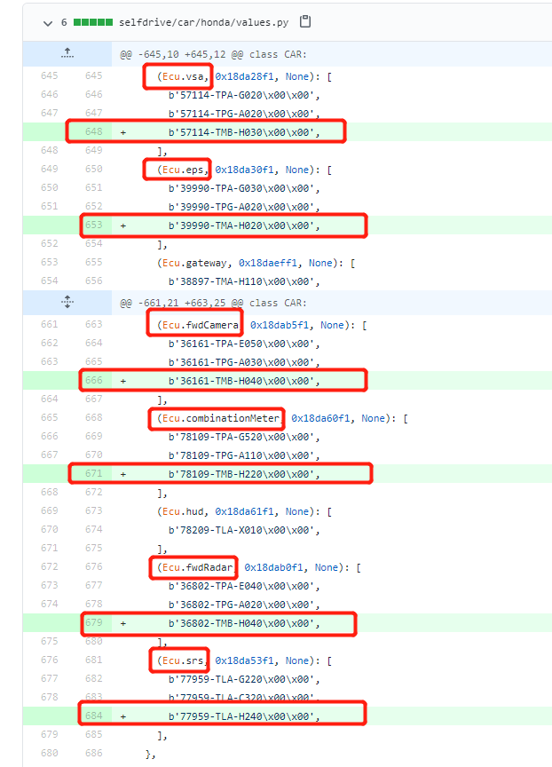
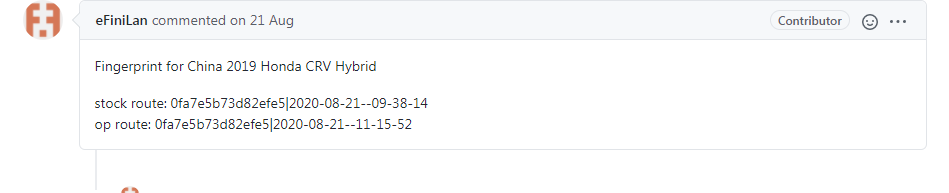

## 连接OBDⅡ接口抓取车辆指纹2.0

基于ECU固件版本的指纹识别车型，就是车辆指纹2.0，需要连接车辆OBDⅡ接口

OpenPilot 0.70之后，开始使用基于ECU固件版本的指纹识别 识别当前连接的什么车型（/data/openpilot/selfdrive/car/{汽车厂商}/values.py 文件中的指纹信息列表）。

有两种方法可以获取车辆2.0指纹，方法一不需要上传数据，方法二适用于近期上传过数据

<u>如果增加了指纹1.0和指纹2.0情况后依然无法控制车辆，可能和车型的DBC文件有关，这个需要联系更专业的人士帮忙处理</u>

**方法一：连接OBDⅡ接口，通过代码方式，获取车辆指纹2.0**

1. 汽车未启动情况下，车辆上OBDⅡ接上线材并连接到 Harness 上，使用SSH终端工具连接到 EON 并打开 SSH 窗口[1]：
```bash
killall tmux
```
2. 启动车辆，在 SSH 窗口[1]输入
```bash
cd /data/openpilot/selfdrive/boardd
./boardd
```
3. 新打开一个 SSH 窗口[2]输入
```bash
cd /data/openpilot/selfdrive/car/
python fw_versions.py --scan
```
4. 等待命令执行结束
```bash
Found FW versions
{
    ...
}
```
以上内容就是你的车辆指纹2.0

**将车辆指纹2.0对应values.py 文件车型和硬件位置填入可暂时使用指纹控制车辆**

以CRV混动2019中国版为例，获得车辆指纹2.0如下

Found FW versions
{
  (Ecu.unknown, 0x18da01f1, None): [b'1K101-5RD-H030\x00\x00']
  (Ecu.unknown, 0x18da02f1, None): [b'1K021-5RD-H020\x00\x00']
  (Ecu.unknown, 0x18da0ef1, None): [b'37805-5TZ-H660\x00\x00']
  (Ecu.unknown, 0x18da0bf1, None): [b'54008-TMB-H510\x00\x00']
  (Ecu.unknown, 0x18da1cf1, None): [b'24851-5WR-A010\x00\x00']
  (Ecu.unknown, 0x18da28f1, None): [b'57114-TMB-H030\x00\x00']
  (Ecu.unknown, 0x18da2af1, None): [b'46114-TMB-H950\x00\x00']
  (Ecu.unknown, 0x18da30f1, None): [b'39990-TMA-H020\x00\x00']
  (Ecu.unknown, 0x18dab5f1, None): [b'36161-TMB-H040\x00\x00']
  (Ecu.unknown, 0x18daeff1, None): [b'38897-TMA-H110\x00\x00']
  (Ecu.unknown, 0x18da53f1, None): [b'77959-TLA-H240\x00\x00']
  (Ecu.unknown, 0x18da60f1, None): [b'78109-TMB-H220\x00\x00']
  (Ecu.unknown, 0x18dab0f1, None): [b'36802-TMB-H040\x00\x00']
}

因为CRV是honda车型，所以在/data/openpilot/selfdrive/car/honda/values.py内

其他车型请注意对应/data/openpilot/selfdrive/car/{汽车厂商}/values.py文件

在values.py内逐个对应增加，每个对应数值为**0x18daxxxx**的，按照规则添加到对应位置


**方法二：连接OBDⅡ接口，登录 my.comma.ai/useradmin ，查看车辆指纹2.0**

以下操作可能需要VPN后进行操作

1.在应用市场下载安装comma connect软件，注册账号后和自己的设备（EON或者C2）配对

2.车辆上OBDⅡ接上线材（comma power v2）并连接到 Harness 上，然后链接到设备（EON或者C2）上，使用官方版 op (包含devel 分支)，eon界面设置为openpilot选项关闭，行驶了10分钟左右距离，将记录上传



3.当记录上传完成后，登录 my.comma.ai/useradmin ， 进入自己账号，点击自己设备的id，如下图示例中ea706777b54a1bca1，设备id可以在设置-设备-下滑到下面看到



**进入自己账号，点击自己设备的id，选择自己最近上传的行驶记录的第一个文件**

  

**进入后再选择第一个-0开头的文件**

  

**搜索文件中 carFW 的字段，carFW里面的就是你的车辆2.0指纹**

  


**将车辆指纹2.0对应values.py 文件车型和硬件位置填入可暂时使用指纹控制车辆**

以CRV混动2019中国版为例，获得车辆指纹2.0如下



因为CRV是honda车型，所以在/data/openpilot/selfdrive/car/honda/values.py内

其他车型请注意对应/data/openpilot/selfdrive/car/{汽车厂商}/values.py文件

values.py内逐个对应增加，每个对应数值为 **ecu= xxx** 的，按照规则添加到对应位置




#### 将车辆指纹2.0提交给官方
   参考https://github.com/commaai/openpilot/wiki/Fingerprinting

方法如下

1. 安装官方版本 op (包含devel 分支)
2. 硬件全部安装上 (含 comma power v2) ，设置为行车记录仪模式 ，不启用openpilot，跑一段约10分钟路程停车后上传记录
3. 上传完成后到 my.comma.ai/useradmin ，从行车记录内查找指纹2.0
4. 把指纹2.0加到对应车型 values.py 放回设备（eon或者C2）中使用
5. 确认设备（eon或者C2）能正常控制车辆
6. 建立 github 账号， fork comma repo
7. 建立一个新的分支，把values.py 提交进去
8. 用自己新建的分支提交 PR 至 comma 的 repo, 提交說明注明你的 dongle ID 和 你对应的上传的形式记录 ID


1-4步就是**方法二：连接OBDⅡ接口，登录 my.comma.ai/useradmin ，查看车辆指纹2.0**

完成了修改values.py文件，在自己车辆上运行openpilot并成功控车后

再次开启数据上传把记录上传给官方

然后fork一个openpilot，把自己的修改增加到自己的fork中去，然后提交pr给官方

注明自己的id和记录时间

 stock route: 设备id号|记录时间（未修改文件运行）
op route: 设备id号|记录时间（修改文件运行）

可以参考

https://github.com/commaai/openpilot/pull/2056



官方确认后就会增加到支持列表中