## 首次使用dragonpilot时候各种画面说明

##### 建议第一次使用dp时候，开启社区功能+启用ssh功能

开启路径--设置--开发人员--开启功能

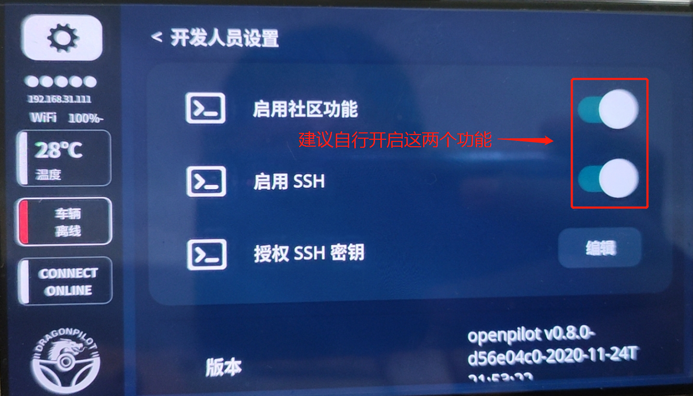


其他画面说明，**一般仅devel分支和testing分支会一直更新**，其他固定版本号的不会更新

是否配对comma connect不影响设备使用

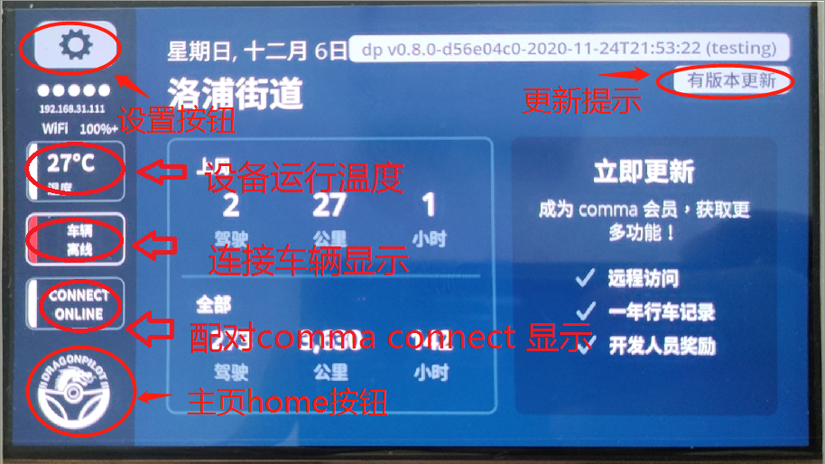

点击更新按钮后显示

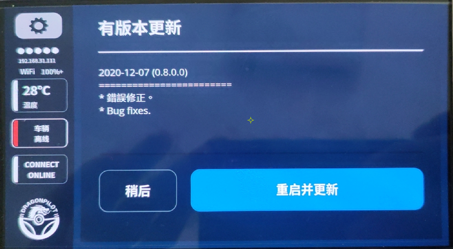

点击设置按钮后显示

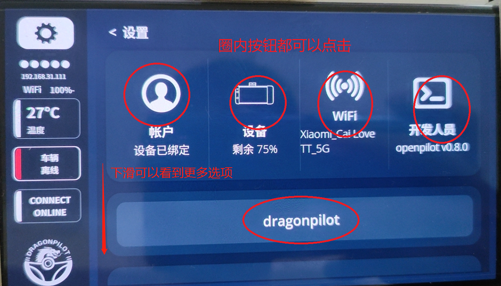

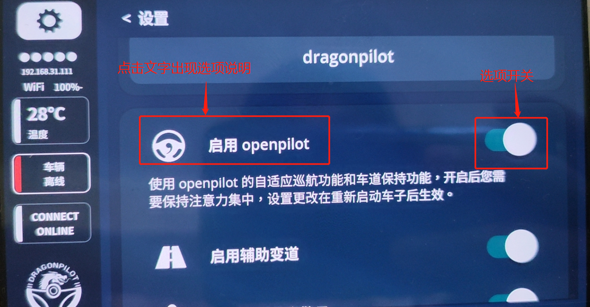


##### 英文界面改中文界面方法，右上角齿轮--安卓设置--语言--中文--备份按钮返回--重启，就可以


##### op软件默认北美时区，时区不正确修改方法，右上角齿轮--安卓设置--时间--关闭自动时间--选择时区---修改24小时--备份选项--重启，就可以


##### openpilot默认选项展示

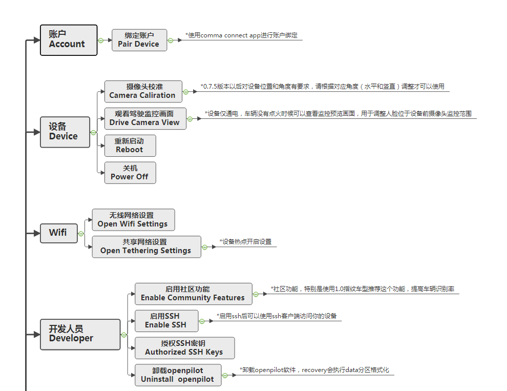


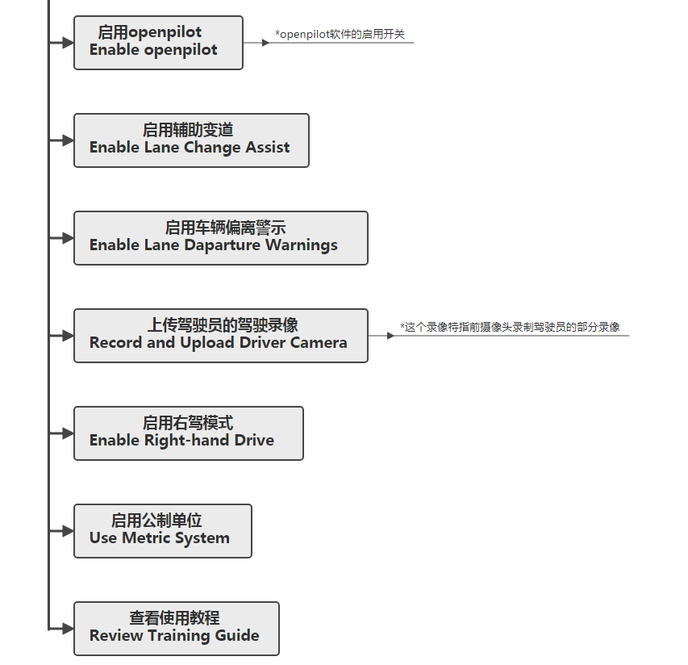


##### dp选项展示

dp选项展示--操控选项

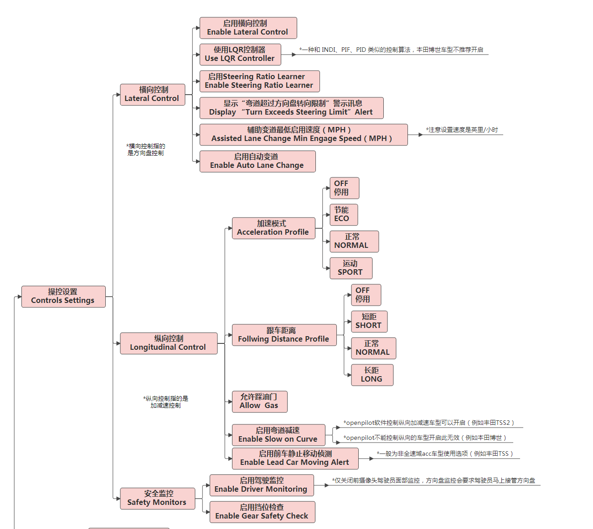


dp选项展示--介面设置

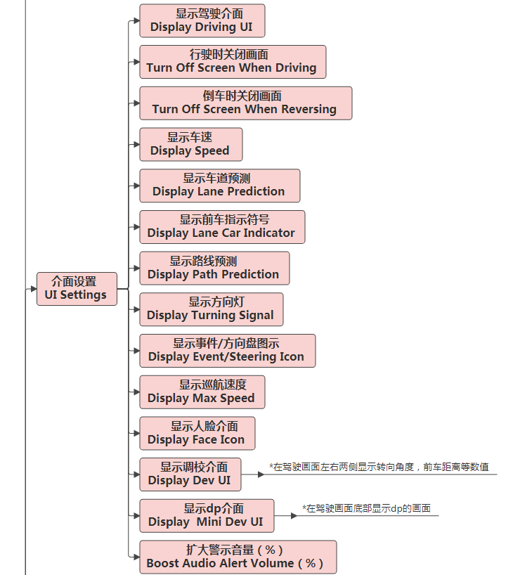


dp选项展示--第三方应用设置

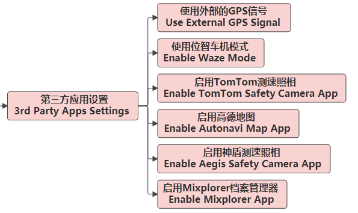


dp选项展示--车型设置

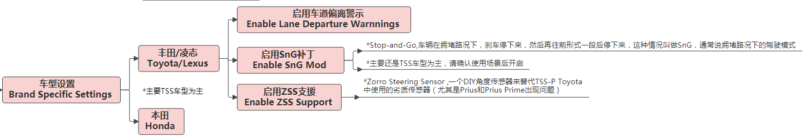


dp选项展示--服务-硬件-指纹-其他


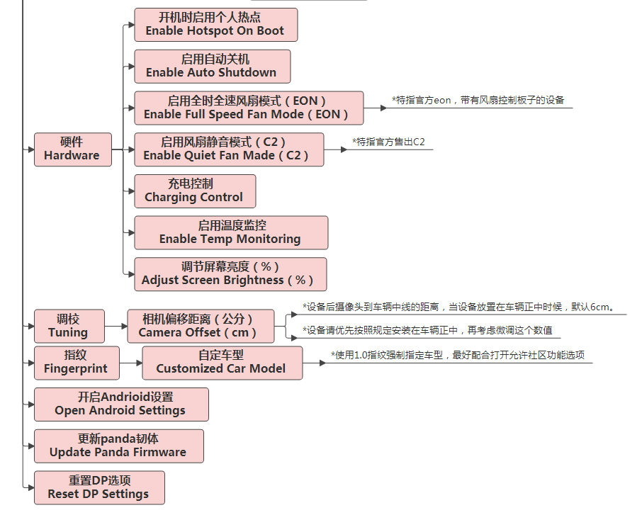


##### 启动NEOS时候画面，开机comma的逗号logo


##### 启动openpilot时候画面，系统开启完成编译软件时候logo，包含进度条

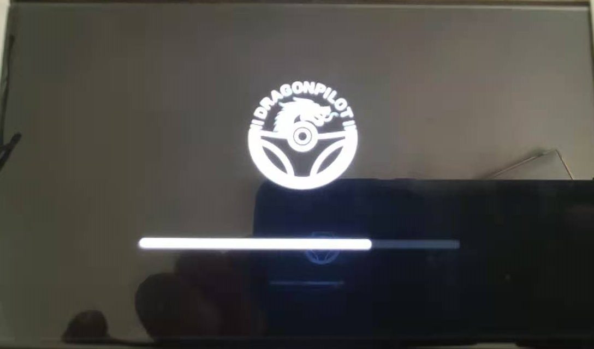

##### 安装画面，installing openpilot字样无进度条说明是在下载，不是在安装！！

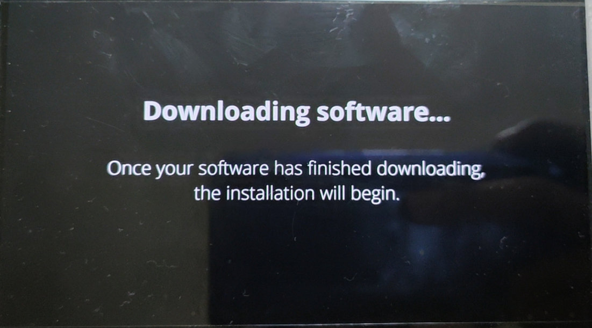


ssh输入tmux at，查看下载速度，一般安装至少200M左右，如果速度慢请改用其他方法安装
```shell
tmux at
```

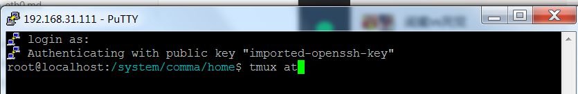

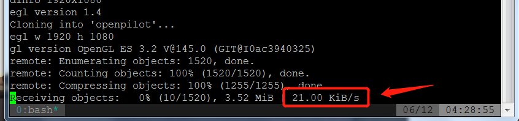


##### 升级画面


##### 升级进度画面，会有两个进度条

直接连接网络在线升级neos会先升级recovery

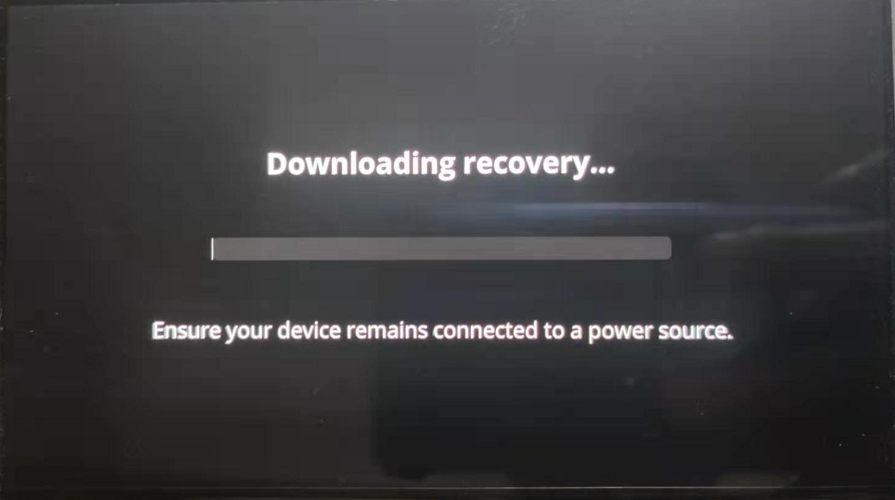

然后升级system


如果网络速度不佳，就会升级失败

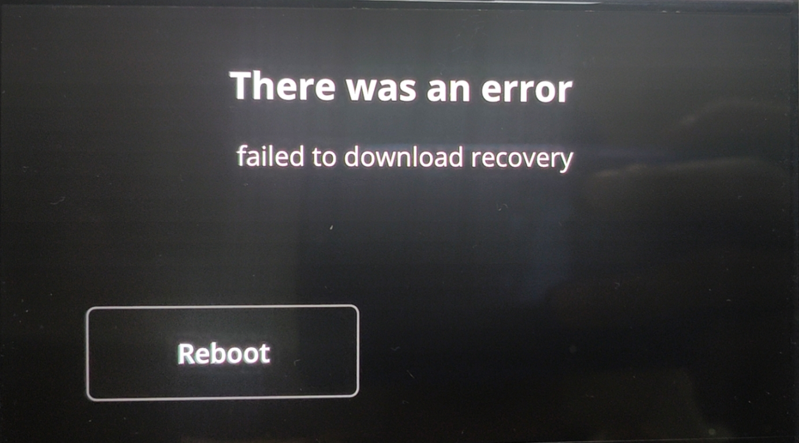

多次自动升级失败请使用点击下面链接采用手动升级方法

[手动升级NEOS15](updateNEOS15.md)

