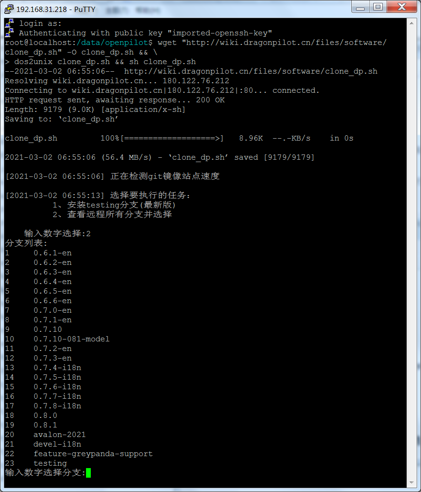

## 使用 Putty SSH 切换 openpilot 分支版本

### 获取 EON 的 IP 地址

#### \- 如果 电脑 和 EON 同时接入网络

1. EON 和 电脑 接入同一局域网（比如连接同一个路由器的 WIFI 信号）。
2. 在 EON 上，通过菜单 "设置 - 网络 - 无线网络设置 - 更多选项（右上角）- 右上角三个点 - 高级"，打开 WiFi 连接信息界面，即可查看 EON IP 地址。


#### \- 如果 电脑 通过 WiFi 连接到了 EON 提供的 WiFi 热点

1. 电脑通过 WIFI 连接到 EON 提供的 WiFi 热点。
2. 电脑的 IP 是 `192.168.43.x`，EON 的IP 固定为 `192.168.43.1`。

附：[EON 如何设置共享 WIFI 热点](how_to_connect_openpilot_via_iphone.md)


### 下载 Putty 和 ppk（私钥）

1. 下载软件 putty （ 自行搜索下载 ）
2. 下载私钥 ppk （ 天翼云链接 https://cloud.189.cn/t/2yMveyqAzmqi ）

### 填写信息，SSH 连接到 EON

1. 打开 Putty 填写 IP 和 Port

2. 点击左侧菜单 "Connection - SSH - Auth"，点击右侧最下面 Browse 选择 ppk 私钥

3. 点击右下角 Open 按钮，弹出窗口点击 "是（Y）"

4. Putty 的 "login as :" 界面输入 `root`，然后回车
5. 进入 EON 的 shell 环境了


选项|填写|备注
-|-|-
Host Name<br>(or IP address)| `192.168.43.1` 或者 EON 的 IP| 第一步查询到的 EON 的 IP
Port| `8022`|SSH 端口号，这里默认是 `8022`
Private Key| 点击 Browse，选择之前下载的 ppk 文件 |ppk 格式为客户端 putty 专用


### 切换 openpilot 分支版本

openpilot 有很多分支，[Openpilot 国内镜像](/mirror.md) 这里有一些同步到 gitee 的分支代码，可以试用一下，看看哪一个版本适合自己。

* [dragonpilot](https://gitee.com/afaaa/dragonpilot) 和 [openpilot-cn](https://gitee.com/afaaa/openpilot-cn) 有中文版，需要的可以尝试
* 如果网络条件好的（有梯子）话，也可以用对应的 Github 地址

依次执行下列命令切换分支版本：
```bash
# 打开 data 目录
cd /data

# 把原来openpilot文件夹重命名为openpilot.bak文件夹
mv openpilot openpilot.bak    #修改op目录名称，此处如果发生断电或者重启，系统无法正常加载（修改前请务必记住，当前的EON的ip地址，否则无法重新连接，继续后面的步骤）

# 下载新的版本分支并命名为openpilot文件夹（git clone 网址 文件夹名）
git clone https://github.com/dragonpilot-community/dragonpilot.git openpilot -b devel-i18n

# 打开 openpilot 目录
cd openpilot

# 查看全部分支 和 当前分支
git branch -a

# 切换到目标分支
git checkout testing

# 重新查看确认当前分支
git branch

# 重启编译
# 0.7 之前的版本使用 make && reboot
rm -rf /tmp/scons_cache && reboot
```

或者用一条命令运行：

```bash
#about 130MB
cd /data/ && \
mv openpilot op_backup_$(date +%Y%m%d%H%M%S) ; \
git clone https://github.com/dragonpilot-community/dragonpilot.git openpilot -b devel-i18n --single-branch --depth=1 && \
cd openpilot/scripts/ && \
./reset_update.sh
```

或者用DP脚本工具：

```bash
wget "http://wiki.dragonpilot.cn/files/software/clone_dp.sh" -O clone_dp.sh && \
dos2unix clone_dp.sh && sh clone_dp.sh
```
putty下ssh使用DP脚本工具效果如图



