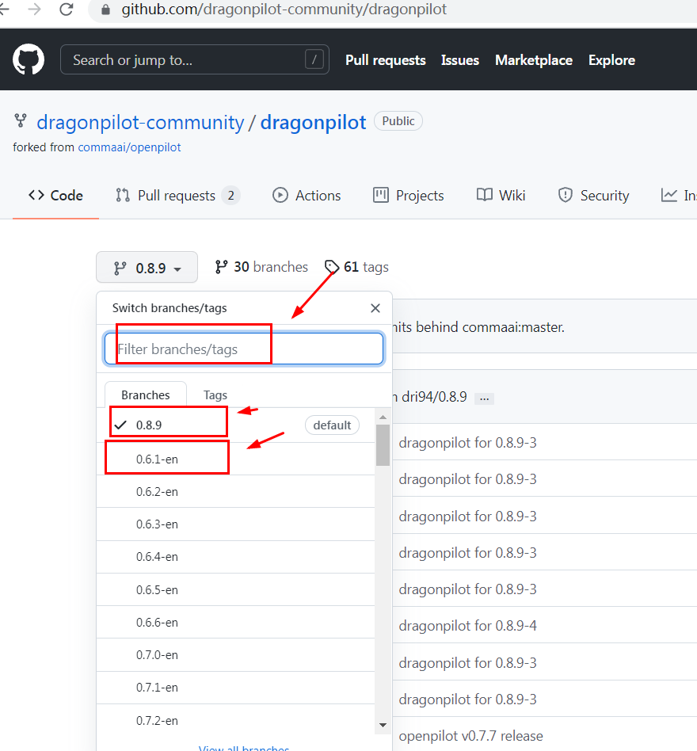

## 通过界面安装 openpilot 分支版本


### 简介

因为大部分用户并不是专业人员，不会通过 ssh 操作切换第三方的 fork，不同小组根据官方的 openpilot 安装方式改写了这项目，使 openpilot 的非官方 fork 安装也可以通过界面操作完成。


目前DP和MP都可以通过UI界面进行安装

###  openpilot原版release2分支
| 镜像源     | 特点      | 域名                          |
| ---------- | --------- | ----------------------------- |
| cnpmjs镜像 | release2分支 | https://wiki.dpp.cool/op/release2 |

###  DP fork
提供两个镜像源ui地址，如果第一个不行可以更换第二个
两个源都不行请检查自己的网络相关问题

镜像1

| 镜像源     | 特点      | 域名                          |
| ---------- | --------- | ----------------------------- |
| cnpmjs镜像 | 0.8.10分支 | https://wiki.dpp.cool/dp1/0810 |
| cnpmjs镜像 | 0.8.9分支 | https://wiki.dpp.cool/dp1/089 |
| cnpmjs镜像 | 0.8.8分支 | https://wiki.dpp.cool/dp1/088 |
| cnpmjs镜像 | 0.8.7分支 | https://wiki.dpp.cool/dp1/087 |
| cnpmjs镜像 | 0.8.5分支 | https://wiki.dpp.cool/dp1/085 |
| cnpmjs镜像 | 0.8.1分支 | https://wiki.dpp.cool/dp1/081 |
| cnpmjs镜像 | 0.7.10分支 | https://wiki.dpp.cool/dp1/0710 |
| cnpmjs镜像 | 0.7.8-i18n分支 | https://wiki.dpp.cool/dp1/078 |

镜像2

| 镜像源     | 特点      | 域名                          |
| ---------- | --------- | ----------------------------- |
| fastgit镜像 | 0.8.10分支 | https://wiki.dpp.cool/dp2/0810 |
| fastgit镜像 | 0.8.9分支 | https://wiki.dpp.cool/dp2/089 |
| fastgit镜像 | 0.8.8分支 | https://wiki.dpp.cool/dp2/088 |
| fastgit镜像 | 0.8.7分支 | https://wiki.dpp.cool/dp2/087 |
| fastgit镜像 | 0.8.5分支 | https://wiki.dpp.cool/dp2/085 |
| fastgit镜像 | 0.8.1分支 | https://wiki.dpp.cool/dp2/081 |
| fastgit镜像 | 0.7.10分支 | https://wiki.dpp.cool/dp2/0710 |
| fastgit镜像 | 0.7.8-i18n分支 | https://wiki.dpp.cool/dp2/078 |


### 买买熊团队支持的 MP fork（MyPilot）
说明：MyPilot团队优先支持其用户使用，更多问题请向MyPilot团队咨询，wiki页面仅做收录无利益相关，也希望更多的不同fork能出现并且能给界面化安装


| 分支名     | 域名                     |
| ---------- | ------------------------ |
| MP稳定版本 | https://c2.openpilot.net |

pc浏览器直接访问https://c2.openpilot.net 可以看到对应的界面管理页面以及MP版本说明


### sshane的UI界面自动安装任意fork方法

githun用户sshane在自己的页面给出的任意安装fork方法，默认使用的是githun镜像源，没有富强速度会慢，特点可以是安装任意fork,分支名必须和githun上对应的一样

如下图示例

分支名必须和githun上一样，0.6.1-en这个分支必须填完整




在设备的ui页面内输入
<u>https://smiskol.com/fork/[githun用户名]/{分支名}/{加载信息}</u>
dp安装

| dp    | 特点      | 域名                          |
| ---------- | --------- | ----------------------------- |
| dp | 0.8.10分支 | https://smiskol.com/fork/dp/0.8.10 |
| dp | 0.8.9分支 | https://smiskol.com/fork/dp/0.8.9 |
| dp | 0.6.1分支 | https://smiskol.com/fork/dp/0.6.1-en |

op安装
| op    | 特点      | 域名                          |
| ---------- | --------- | ----------------------------- |
| op | release2分支 | https://smiskol.com/fork/commaai |

sshane的fork安装
| sshane    | 特点      | 域名                          |
| ---------- | --------- | ----------------------------- |
| sshane | 默认分支 | https://smiskol.com/fork/shane |


国内用户mr-one按照sshane的网站架设了镜像网站，使用cnpmjs镜像源，所以国内可以使用这个网址

在设备的ui页面内输入
<u>https://mr-one.cn/fork/[githun用户名]/{分支名}/{加载信息}</u>

dp安装

| dp   | 特点       | 域名                               |
| ---- | ---------- | ---------------------------------- |
| dp   | 0.8.10分支 | https://mr-one.cn/fork/dp/0.8.10 |
| dp   | 0.8.9分支  | https://mr-one.cn/fork/dp/0.8.9  |
| dp   | 0.6.1分支 | https://mr-one.cn/fork/dp/0.6.1-en |

op安装

| op   | 特点         | 域名                             |
| ---- | ------------ | -------------------------------- |
| op   | release2分支 | https://mr-one.cn/fork/commaai |

sshane的fork安装

| sshane | 特点     | 域名                         |
| ------ | -------- | ---------------------------- |
| sshane | 默认分支 | https://mr-one.cn/fork/shane |


### SSH安装方法

如果使用界面安装多次失败，主要是手机热点或者移动宽带，联通宽带失败情况下，请尝试用ssh代码安装

使用ssh代码，属于高阶内容，需要使用ssh工具进行git操作，如果有兴趣的请先阅读高阶教程
* [配置putty和winscp](cn/putty_and_winscp.md)
* [使用 Putty SSH 切换 openpilot 分支版本](cn/how_to_change_openpilot_fork_on_windows.md)
* [iPhone 手机上 SSH 连接到 openpilot](cn/how_to_connect_openpilot_via_iphone.md)

查看教程后，按照教程使用ssh工具连接你设备，然后复制下面代码进行安装

以下是使用DP安装脚本工具：

```bash
wget "http://wiki.dragonpilot.cn/files/software/clone_dp.sh" -O clone_dp.sh && \
dos2unix clone_dp.sh && sh clone_dp.sh
```

putty下ssh使用DP脚本工具效果如图


###  NEOS 系统安装参考：
- [Windows 下手动安装 NEOS系统+openpilot软件教程](cn/how_to_flash_openpilot_on_windows_step_by_step.md)
- [Windows 下一键安装 NEOS系统+openpilot软件 教程](/cn/how_to_flash_openpilot_on_windows.md)
- [macOS 下手动安装 NEOS系统+openpilot软件教程](cn/how_to_flash_openpilot_on_mac.md)


如果你已经安装了 openpilot，那么你可以通过先 **卸载 openpilot**，然后重新回到输入 Software Url 的界面，输入上述地址即可。


<center>


</center>


### 相关源码（自动生成installer有兴趣的请自行研究）

- [https://d.sdut.me/installers](https://d.sdut.me/installers/)
- [https://github.com/rming/openpilot/tree/installer](https://github.com/Rming/openpilot/blob/installer/installer/make_installer.py)
- [https://github.com/Rming/openpilot.download](https://github.com/Rming/openpilot.download)
