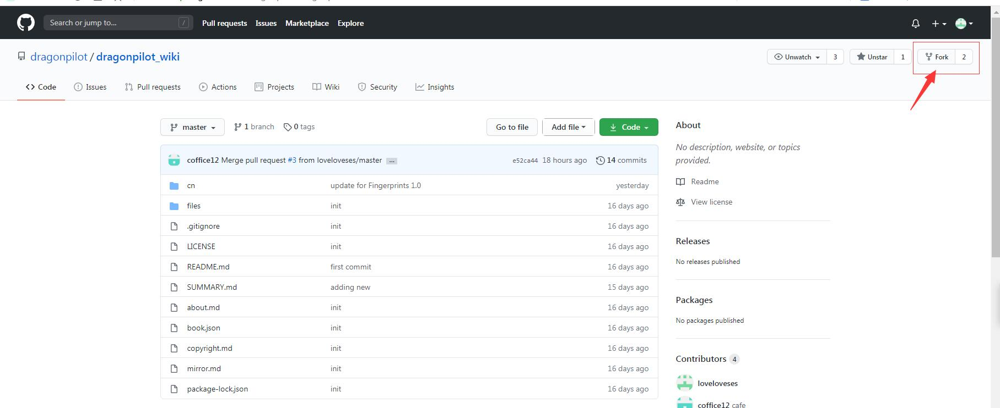
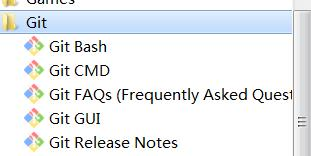
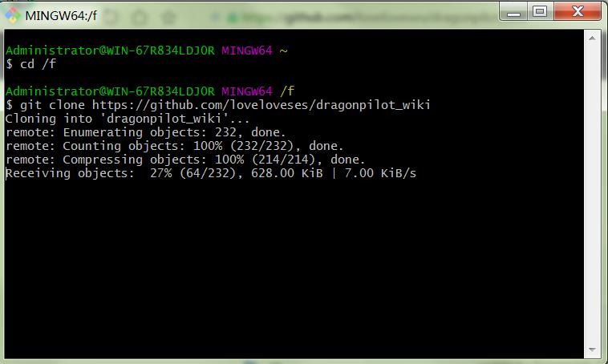
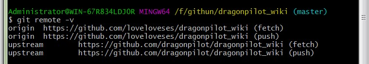
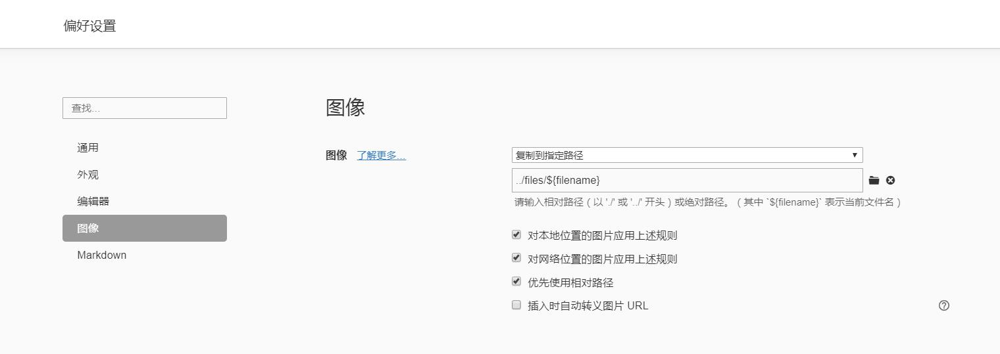
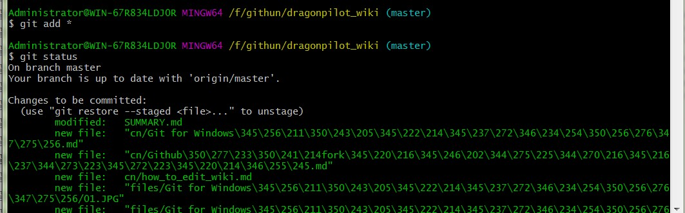

### 欢迎大家都来维护op中文百科

想要维护op中文百科的时候可以参考以下步骤

1.建立一个 github 账号


2.在 dragonpilot/dragonpilot_wiki 页面的右上角点 "fork"


2.windows/linux 下安装 git 应用，以下以git for windows 为例，安装git for windows参考

[Git for Windows安装和基本设置](Git for Windows安装和基本设置.md)

4.打开git for windows里面的Git Bash，更多git for windows工具用法可以自行搜索



5.git clone https://github.com/<你的账号URL>/dragonpilot_wiki



6.进入对应下载的dragonpilot_wiki文件夹

```bash
cd dragonpilot_wiki
```
###### 

7.设置和同步upstream上游代码库，参考以下链接，然后每次修改之前都进行一次同步
[Github进行fork后如何与原仓库同步](Github进行fork后如何与原仓库同步.md)

运行
```bash
git remote -v
```


然后添加 
```bash
git remote add upstream https://github.com/dragonpilot/dragonpilot_wiki
```

成功后
```bash
git remote -v
```

显示如下



8.修改內容，修改内容根据自己水平，可以用各种 Markdown 工具，我这里用的是Typora

为了保证图片的位置不混乱，建议图片都保存到指定路径

Typora的图片设置推荐如下路径 ../files/${filename}



9.检查文件状态并添加文件

git add <文件名> 增加单个文件  

或是  

git add * 增加所有修改文件
```bash
git add *
```



git status 可以查看情况

10.git commit -m "your note" 添加说明，主要说明这次提交的是什么修改


11.git push -u origin

12.到 dragonpilot/dragonpilot_wiki 点 New Pull Request.