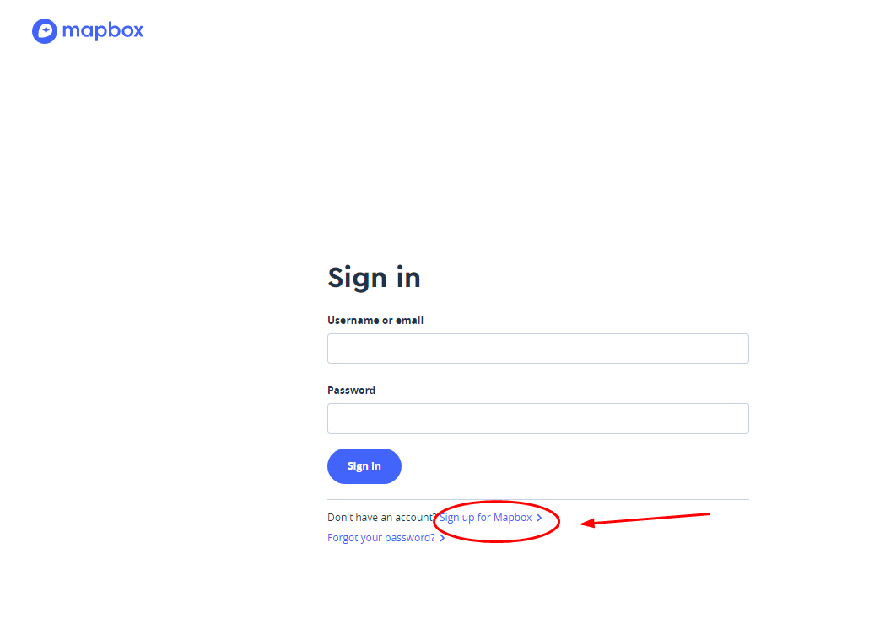

# DP导航使用方法

#### 1.eon设备里面里面开启功能，并重启设备

#### DP-map选项--Enable Nav.

#### 2.到mapbox网站申请个人秘钥，必须是sk.开头的秘钥，将秘钥粘贴到eon设备秘钥管理页面

#### 3.eon设备管理秘钥界面地址（pc端输入网址，微信扫码），设备需要开机，需要在网页的同一个wifi下面

#### 4.粘贴秘钥后刷新页面，下次登录即为导航。输入地址后点击Start Navigation，即可

申请网址：

https://account.mapbox.com/auth/signin/?route-to=%22https://account.mapbox.com/access-tokens/%22

