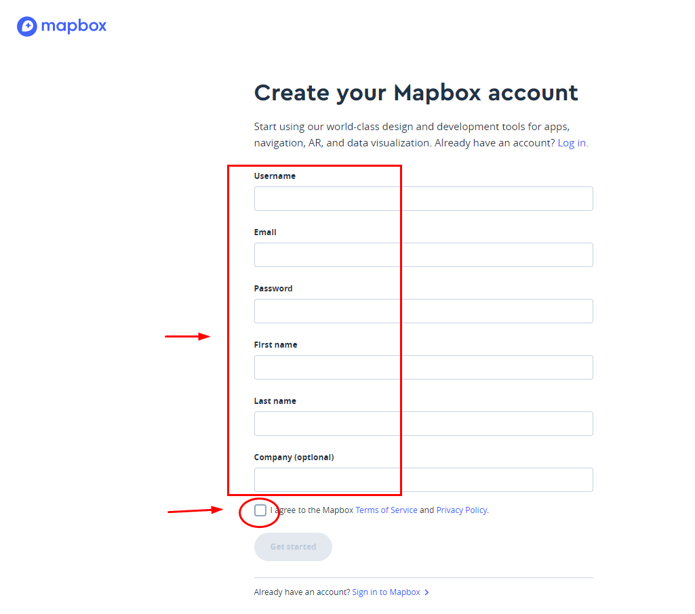

# DP导航使用方法（dp0.8.9-3版本以上版本）

**注意**

**1.设备启用导航功能后，接车黑屏，可能是ui有问题，断开设备和车辆连接，重启后，需要卸载重新安装可能解决问题**

**2.一加设备对neos17兼容仅到dp0.8.9-3，使用dp0.8.10必须升级到neos18,需要手动升级到neos18，然后安装一加开机专用upadte文件，教程参考下面**

[手动升级NEOS15](updateNEOS15.md)

[在一加3T手机上安装DP0.8.4版本](HOWTO-ONEPLUS.md)

[dp阿里云地址neos18](https://dragonpilot.oss-cn-shanghai.aliyuncs.com/otherFiles/neos/neos18/ota-signed-5dc2575d713977666a8e14ae1b43a04d7f63123934c80fa10751d949a107653e.zip)

 [一加手机专用开机upadte，刷完neos18以后使用](https://dragonpilot.oss-cn-shanghai.aliyuncs.com/otherFiles/neos/neos18/update.zip)

**3.自定义地图功能dp0.8.10功能**

=======================我是分割线=======================

#### 1.eon设备里面里面开启功能，并重启设备

#### DP-map选项--Enable Nav.（dp0.8.10现在已经增加google输入定位）

#### 2.mapbox秘钥，到mapbox网站申请公共秘钥（pk.开头）和个人秘钥（sk.开头），将公共秘钥和个人秘钥按照网页提示（注意提示时候pk和sk开头），依次粘贴到eon设备秘钥管理页面

#### 3.google秘钥申请到google网站，需要富强，需要准备一个信用卡，略麻烦

#### 4.eon设备管理秘钥界面地址（pc端输入网址，微信扫码），设备需要开机，需要在网页的同一个wifi下面

#### 5.粘贴秘钥后刷新页面，下次登录即为导航。输入地址后点击Start Navigation，即可

#### 6.秘钥第一次粘贴以后，可以自行导出保存，方便下次可以自行传输进dp目录，快捷操作，方法见页末

=======================我是分割线=======================

### 1.mapbox秘钥申请方法

申请网址：

https://account.mapbox.com/auth/signin/?route-to=%22https://account.mapbox.com/access-tokens/%22

##### 第一次按照提示粘贴pk开头公共秘钥

##### 第二次按照提示粘贴sk开头公共秘钥

##### 注意画面里面提示

=======================我是分割线=======================

### 2.google秘钥申请方法（感谢台湾豆友邓育林提供）

申请网址，需要富强，需要有google账号：

https://console.cloud.google.com/apis/credentials

新建项目，然后建立凭证

 

 

开启以下两个链接，点选启动键

https://console.cloud.google.com/apis/library/places-backend.googleapis.com

 

https://console.cloud.google.com/apis/library/maps-backend.googleapis.com

 

点选链接设定账单咨询，需准备信用卡

https://console.cloud.google.com/projectselector/billing/enable

 

以下采用google map 搜索模式

输入地址或地点后，点选你要的地址或地点栏位，即可

=======================我是分割线=======================

### 3.导航画面

必须条件

1.填入mapbox秘钥后（mapbox秘钥为必须，pk和sk秘钥都需要填入，google秘钥为非必要）

2.设备联网（插手机卡或者连接wifi热点）

3.panda上有gps芯片，C2默认可以使用，带gps芯片的黑熊也可以使用，没有gps芯片的黑熊自行加gps芯片也可以使用

设备联网，连接车辆以后，会短暂的下载地图

tip1：如果长时间出于Map Loading，请查看自己的mapbox秘钥设定是不是有问题，或者网络有问题

tip2：地图可以自定义，教程参考[MAPBOX 建立样式及设定中文地图名称](mapbox_Map_change.md)

默认分屏模式，没有开启导航显示为下图

默认分屏模式下，搜索地点开启导航以后，右边地图会进入导航出现蓝色线标，即进入导航模式

选择全屏幕导航时候，点击eon会进入全屏幕导航画面，从全屏幕切换回eon画面，需要**点击或者滑动**屏幕边缘，即绿色边框位置

下图来自于自定义地图，教程参考[MAPBOX 建立样式及设定中文地图名称](mapbox_Map_change.md)

**（一加手机反应比较灵敏，点击边框基本每次生效，酷派或者乐视手机绿色边框反应有时候不灵敏，所以建议采用在边框滑动方法)**

如需要停止导航模式，点击dp的龙芯logo

即可结束导航模式。

=======================我是分割线=======================

#### 4.保存或者删除dp内秘钥

如果想要保存，或者重新输入pk、sk TOKEN 及 google map api key(将档案删除)

(0.8.9)

rm -fr /data/params/d_tmp/dp_mapbox_gmap_key

rm -fr /data/params/d_tmp/dp_mapbox_token_pk

rm -fr /data/params/d_tmp/dp_mapbox_token_sk

(0.8.10+)

rm -fr /data/params/d_tmp/dp_nav_gmap_key

rm -fr /data/params/d_tmp/dp_mapbox_token_pk

rm -fr /data/params/d_tmp/dp_mapbox_token_sk

或

(0.8.9)

rm -fr /data/params/d/dp_mapbox_gmap_key

rm -fr /data/params/d/dp_mapbox_token_pk

rm -fr /data/params/d/dp_mapbox_token_sk

(0.8.10+)

rm -fr /data/params/d/dp_nav_gmap_key

rm -fr /data/params/d/dp_nav_mapbox_token_pk

rm -fr /data/params/d/dp_nav_mapbox_token_sk

或用winscp 將token秘钥自行保存或者删除，重装的时候可以直接传入token秘钥，不用再次通过网页粘贴

