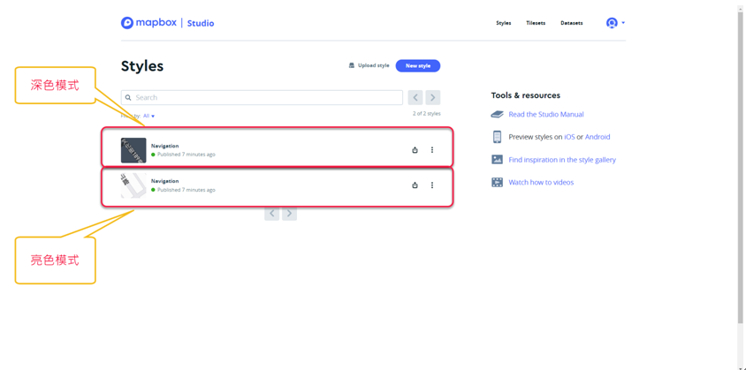

# MAPBOX 建立样式及设定个性化中文地图名称

**注意本功能为dp0.8.10新增加功能**

 

设定网址：

https://studio.mapbox.com/

选择已存在样式，进入设定中文，可以根据自己需要设定成简体中文或者繁体中文

如下所示点选各项语言，选择设定地图的字体，修改完成需要点击发布Publish

深色模式（夜间模式）设定后，可再进行亮色模式（日间模式）设定。

回到样式界面，将发布的地图连接进行复制后，取代删除线对应的网址，通过ssh方式传输到自己设备内，替换dp的默认文件，即可得到自己的个性化中文地图。

以下代码在ssh方式内输入

深色模式

echo -n ~~mapbox://styles/ricklan/ckvqagdpl8tj815qljvf9kbee~~ > /data/params/d/dp_nav_style_night

亮色模式

echo -n ~~mapbox://styles/ricklan/ckvq974qa4rt515me99umzhc2~~ > /data/params/d/dp_nav_style_day

ssh输入效果参考下图

自定义地图参考效果，下图是全屏切换动态图

从全屏幕切换回eon画面，需要**点击或者滑动**屏幕边缘，即绿色边框位置

**（一加手机反应比较灵敏，点击边框基本每次生效，酷派或者乐视手机绿色边框反应有时候不灵敏，所以建议采用在边框滑动方法)**

分屏模式下

全屏模式下

