### 配置putty和winscp

SSh终端工具有很多种，这里仅以putty和winscp做示例，其他的都是一样的

相关软件下载
Putty （SSH 工具）
天翼云链接 https://cloud.189.cn/t/fmEBreUFbaMn

Winscp （Windows 下通过 SSH 传输文件工具）
天翼云链接 https://cloud.189.cn/t/IjAvyq6ZbQ3m

Openpilot SSH 私钥-ppk类型，putty和winscp使用，pem为私钥文件格式
天翼云链接 https://cloud.189.cn/t/2yMveyqAzmqi

从openpilot0.76版本开始默认关闭ssh选项，使用ssh时候请先开启，齿轮（设置）--开发人员--启用ssh

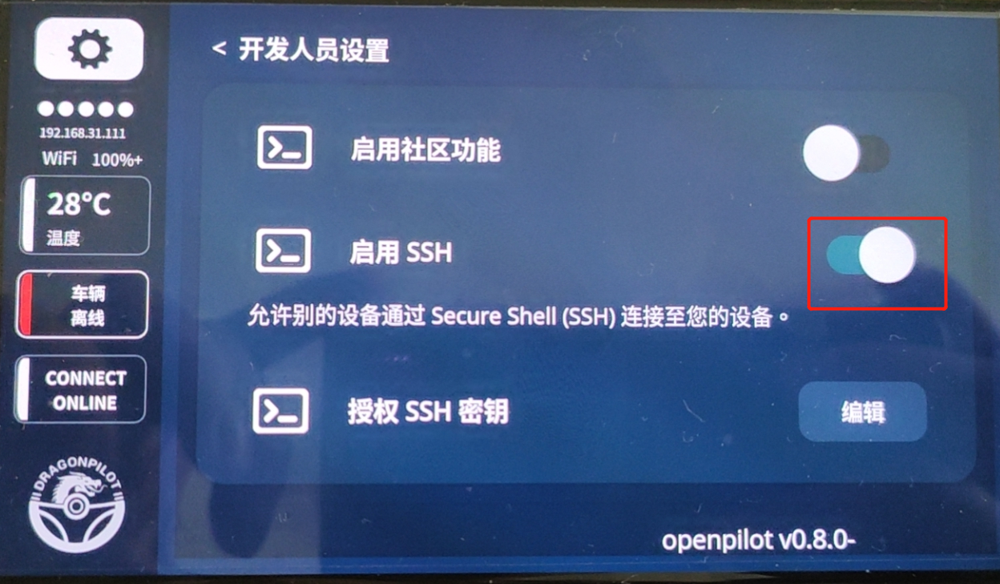

#### 1.获取手机ip地址，dp的话直接会在页面上显示，如下图192.168.31.207

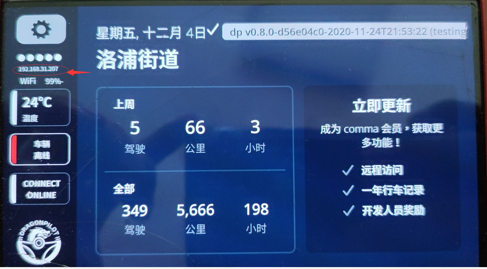

为了自己方便，可以通过路由固定手机ip地址

原版openpilot或者其他分支可以这样查看，点击齿轮—网络—open wifi setting—右上角三个点—Avdanced---下拉最后可以看到ip地址

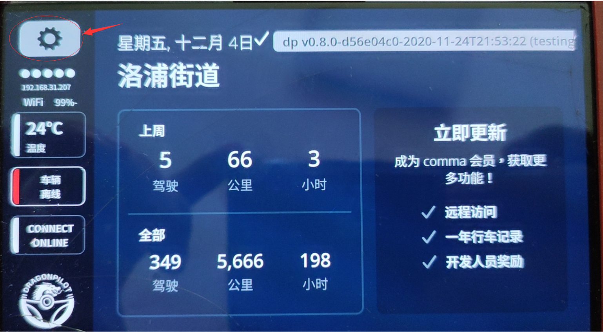

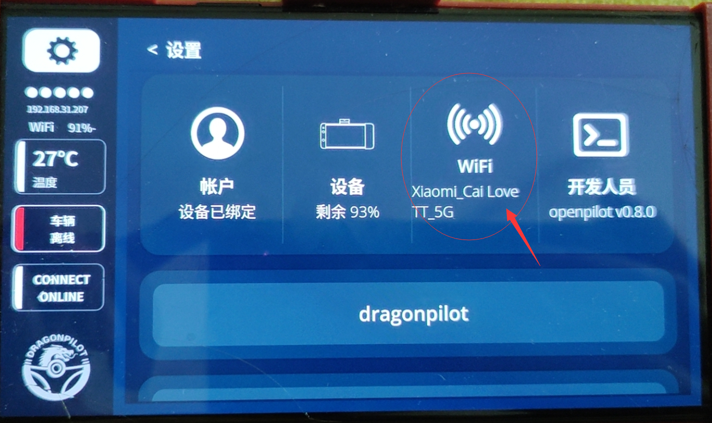

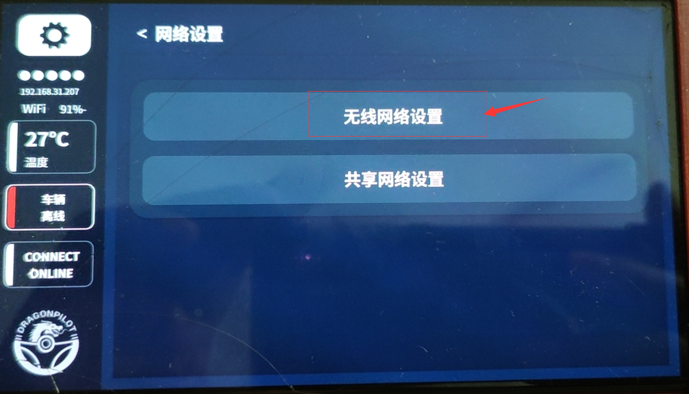

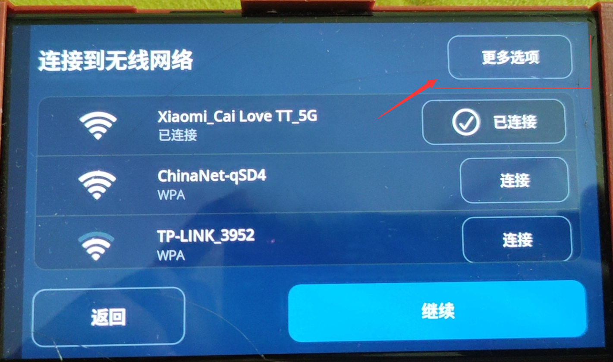

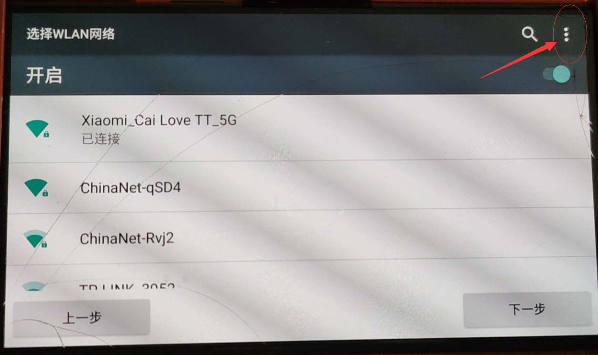

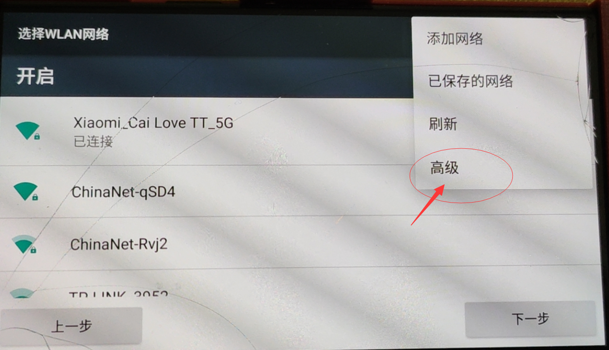

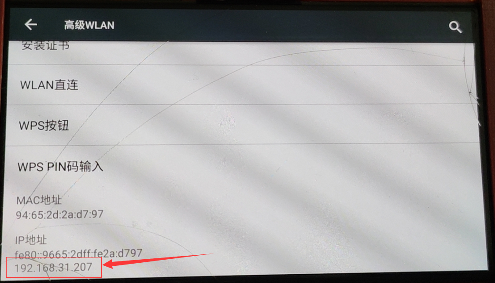

拿到ip地址以后，就可以在putty设置页面内填写

#### 2.配置putty

下次可以直接点击配置登录，ip地址，端口8022，选择ssh方式，并且保存自己的设置

   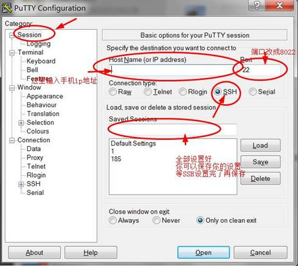

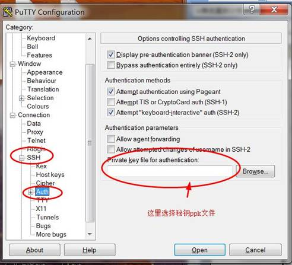

登录后回车

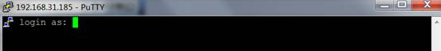

载入秘钥之后，进入

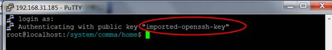

 

以上属于配置putty完成。

 

#### 3.配置winscp

winscp是可视化，实在记不住命令行时候可以用这个，特别的

###### winscp在eon和电脑都是5ghz 的wifi情况下，可以达到相当快的传输速度，省得用线插拔

已经配置好putty的情况下，安装winscp之后会提示导入putty设置，可以快捷导入不用重新配置

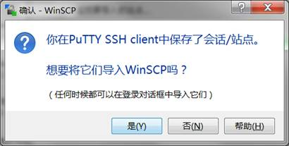

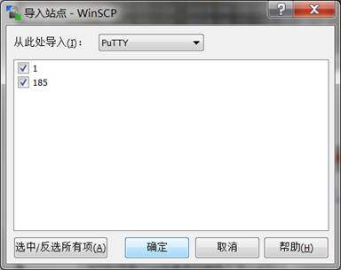

这两个是我的配置ip，所以直接导入

唯一区别是记得要输入用户名：root

其他不用改，就可以选择登陆了

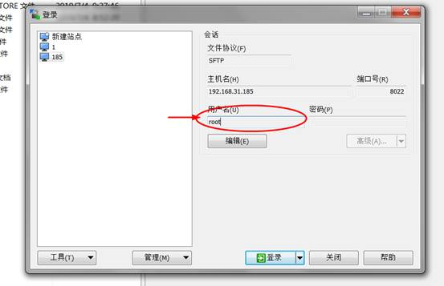

这里就自动使用原来的秘钥登录，也不用你设置了，就算设置和putty也一样

 登录之后，就和FTP一样，左边是自己电脑，右边就是手机文件，可视化，改文件名上传下载都可以

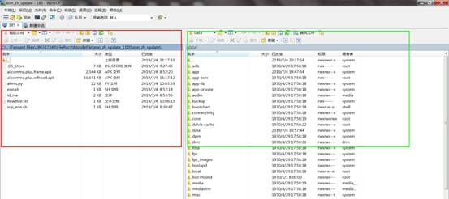

未安装putty时候，需要自行配置winscp

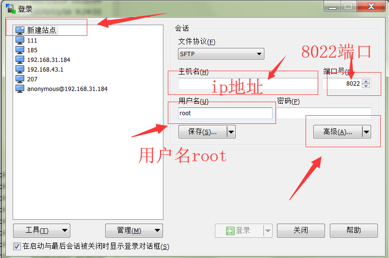

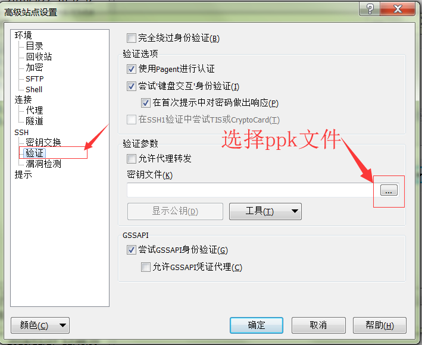

确定后可以保存自己的配置

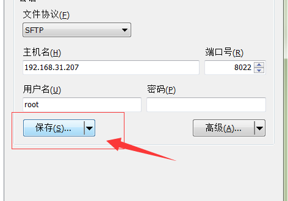

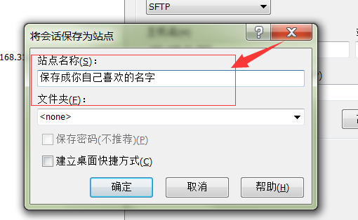

下次可以直接点击配置进入

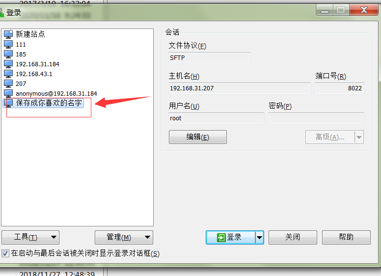

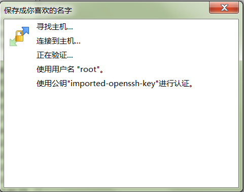