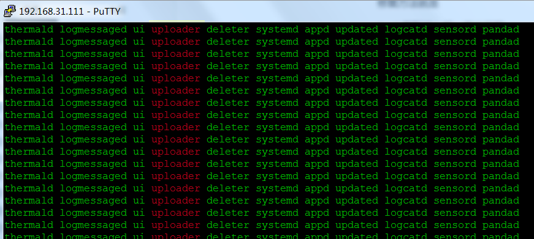
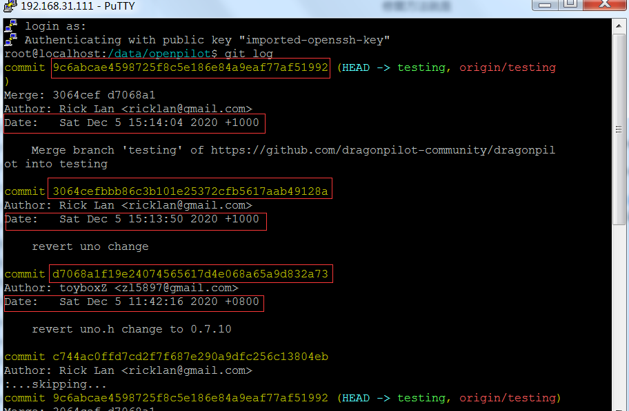
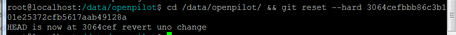

# openpilot常见问题和解决方法---新手向

使用openpilot中可能遇到一些情况，这里做一下一般性汇总

文中使用ssh终端以putty和winscp为主，配置参考下面链接

* [配置putty和winscp](putty_and_winscp.md)
* [iPhone 手机上 SSH 连接到 openpilot](how_to_connect_openpilot_via_iphone.md)

**ssh输入tmux at，查看当前进程，查看问题使用最经常的一个代码**

```shell
tmux at
```


#### 常见问题一：遇到eon或者C2报错，不能正常使用的时候

请找到安全的地方停车，然后使用SSH终端检查错误

###### 打开这个功能需要SSH到终端进行：

###### tmux at 查看进程全部绿色的说明都是正常，如果有红色的说这个进程有问题，需要联系fork作者修复

```shell
tmux at
```

正常的情况


发生问题的情况




###### 全部绿色不可以使用或者有红色不可以使用的时候，可以选择处理方法有回退到之前可以使用版本或者切换到其他可以使用分分支，以下方法是回退版本

###### git log 查看版本

```shell
cd /data/openpilot/ && git log
```

查看版本时候注意版本显示的时间，对应时间来确定自己ok的版本，可以确定在哪个更新时候发生问题，上报错误可以帮助修改



###### git git reset --hard +版本号回退到指定版本

例如我要回退到 3064cefbbb86c3b101e25372cfb5617aab49128a，就是 Date:   Sat Dec 5 15:13:50 2020 的版本的话


```shell
cd /data/openpilot/ && git reset --hard 3064cefbbb86c3b101e25372cfb5617aab49128a
```



这样就回退成功，方便某些情况下解决更新后不能使用的问题

后续如果需要更新再自行运行git pull更新即可


#### 常见问题：开机黑屏

##### NEOS是操作系统，openpilot是软件，可以进NEOS就是可以用ssh终端进入

我们说的一键刷NEOS，升级NEOS，都是特指升级系统， [NEOS和openpilot对应点这里可以查看](how_to_downgrade_neos.md)

openpilot是软件，运行时候运行这个文件夹，按照自己硬盘命名文件理解就行，当你把openpilot文件名命名为A，NEOS就因为无法运行openpilot文件变成黑屏


使用代码升级，但是不熟悉mv语句，修改或删除了openpilot文件夹后，下载又失败，导致开机黑屏

只要设备以前连过wifi，就可以通过ssh终端进入


##### 1.注意自己代码中是否有 mv 语句（修改文件名称），如果有mv 语句，请注意回退修改文件夹名即可

示例，dp一步升级代码，其中包含**mv openpilot**语句，修改了openpilot文件夹名称

cd /data/ && mv openpilot op_backup_$(date +%Y%m%d%H%M%S) && git clone https://github.com/dragonpilot-community/dragonpilot.git openpilot -b devel-i18n && cd openpilot/scripts/ && ./reset_update.sh

如果下载失败的时候，会黑屏无法进入

修复方法就是

1.ssh重新进入后，再次下载

2.把已经改名的文件夹改回来


##### 2.注意自己代码中是否有 rm -rf openpilot，rm -rf 是删除openpilot文件夹

示例，下载安装kegman分支代码，其中包含 **rm -rf openpilot**，运行会删除openpilot文件夹

cd /data && rm -rf openpilot && git clone  https://github.com.cnpmjs.org/kegman/openpilot openpilot && cd openpilot && git checkout kegman-0.7.3 && scons -i && reboot

如果下载失败的时候，会黑屏无法进入

修复方法就是

1.ssh重新进入后，再次下载


#### 常见问题开机各种画面

##### 启动NEOS时候画面，开机comma的逗号logo


##### 启动openpilot时候画面，系统开启完成编译软件时候logo，包含进度条


##### 安装画面，installing openpilot字样无进度条说明是在下载，不是在安装！！


ssh输入tmux at，查看下载速度，一般安装至少200M左右，如果速度慢请改用其他方法安装
```shell
tmux at
```


##### 升级画面


##### 升级进度画面，会有两个进度条

直接连接网络在线升级neos会先升级recovery


然后升级system


如果网络速度不佳，就会升级失败


多次自动升级失败请使用点击下面链接采用手动升级方法

[手动升级NEOS15](updateNEOS15.md)


