# 乐视FlashOne工具FASTBOOT模式/QFIL模式升级刷机图文解说教程

来源http://www.viprom.cn/course/4721.html

适用于乐Pro3
测试模式
*#*#9755#*#*
工程模式
*#*#9756#*#*

想玩游戏不卡的试一下 下面的方法，
拨号界面→工程模式→开关配置→打开高温限制

**乐视FlashOne工具FASTBOOT模式/QFIL模式升级刷机图文解说教程**

工具的开发目标是统一乐视超级手机二代产品的刷机工具； l工具具备自升级功能，能够在线同步新机型和对应软件版本的映射列表等配置信息； l工具尽可能提供“傻瓜式”的操作方法，支持Fastboot和QFIL方式，覆盖大多数的售后刷机需求

Ø 注意

• 工具不支持中文字符，请尽量选择根目录。
• 目前此工具支持产品：乐2、乐2Pro、乐Max2（X520/X620/X820），乐3Pro，酷派C105-6
• 当前工具版本：V1.9/V2.0 工具下载：

**Fastboot模式**

步骤一：打开升级工具，main.exe.

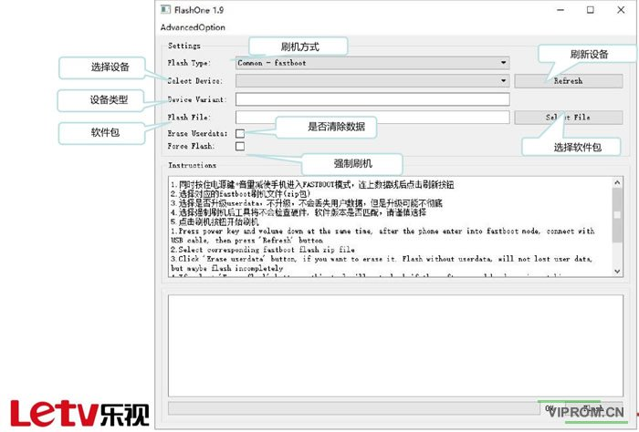

步骤二：选项填写。
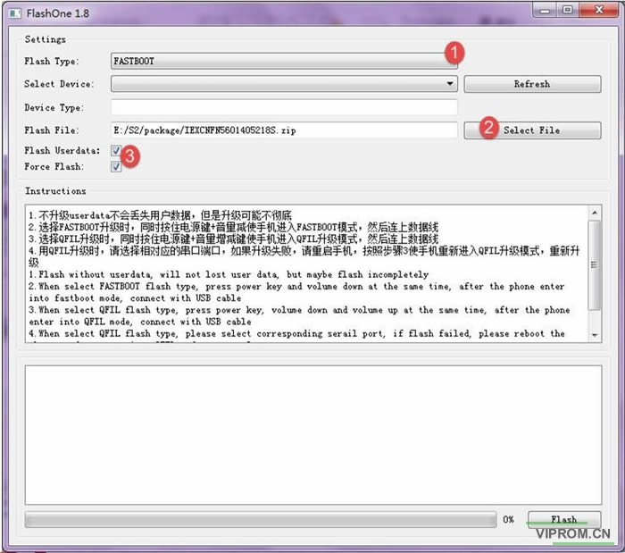

1、刷机方式 FASTBOOT
2、选择升级包。
3、 必选项.选择是否刷 userdata,强制刷机打钩

**友情提示：请提前做好系统备份**

 

步骤三：手机的设置。 手机关机状态下，同时按下‘音量下按键+开关键’，待手机震动后，松开开 关键，等待屏幕出现刷机模式时，松开音量下，手机进入FASTBOOT模式， 插入USB线连接电脑。

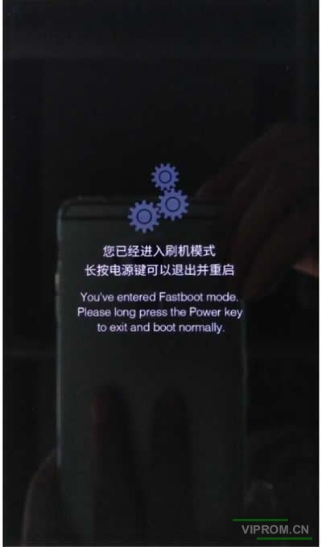

步骤四: 刷新设备 点击刷新设备，会自动显示当前设备

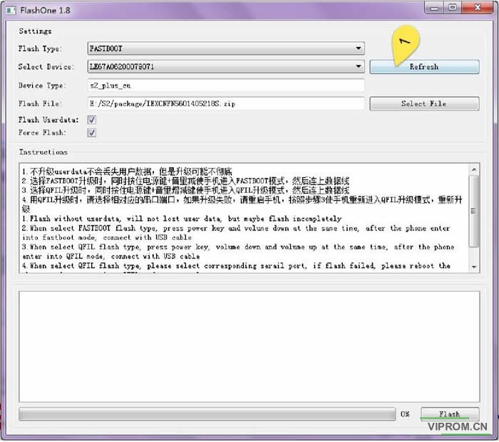

步骤五：点击开始升级，第一次升级需要解压。
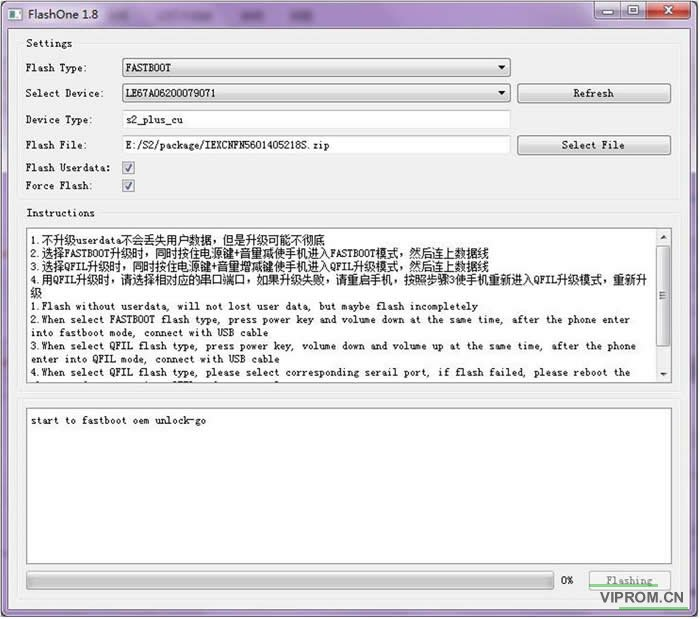
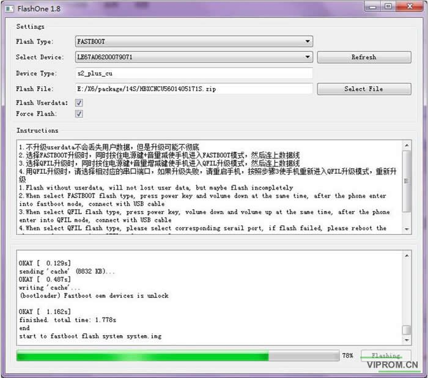

步骤六：升级完成。
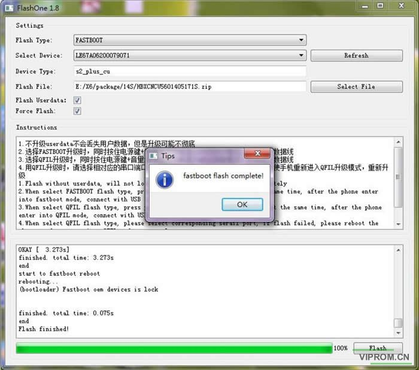

问题：

Ø 如果刷新设备为空，在点击开始刷机时，会提示‘请选择设备’。 Ø 如果软件包选择的型号不匹配，会有提示。

Ø 第一次升级，会先解压软件包，之后的升级如果软件包没有变化，会有一个提示‘是否需要重新解压’， 可以选择‘No’，这样就不用重复升级前解压的步骤了。
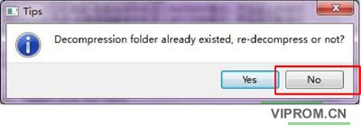

**QFIL模式升级**

**QFIL就是所谓的9008模式**

此方法是针对手机无法开机，或者无法进入Fastboot模式。 主要表现是：完全不开机，或者连接电脑显示如下端口的。
• 对于高通平台：包括X820、X520系列，可以强制把手机切换到QFIL模式。 关机状态下，同时按住手机的开关键、音量上和下，使手机进入QFIL模 式。
• MTK平台：包括X620系列。关机后，按住音量上开机进入MTK USB Port。

**高通平台：包括X520、X820 刷机步骤类似于fastboot.**
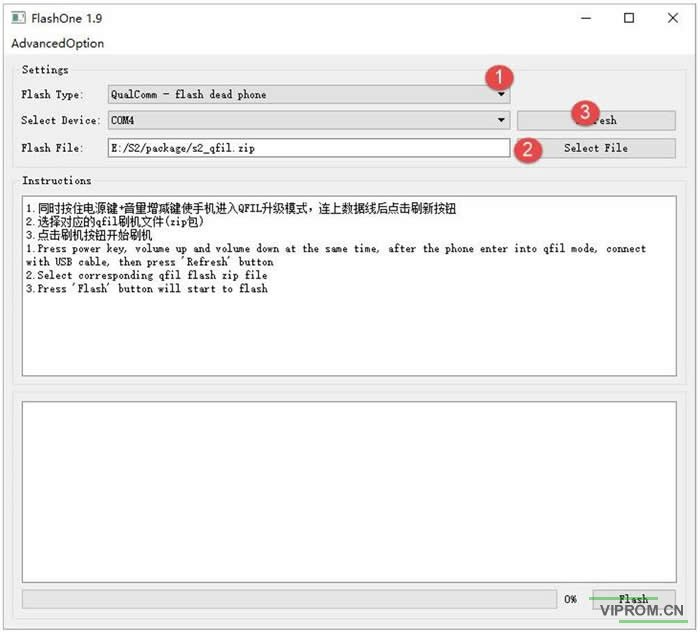
步骤一：选择刷机方式 Qualcomm_flash dead phone.
步骤二：升级包选择对应的qfil包
步骤三：插入手机，刷新设备显示 COM口
步骤四：点击开始刷机。第一次刷机需 要解压软件包。

 

 

**MTK平台：包括X620系列 刷机步骤类似于fastboot.
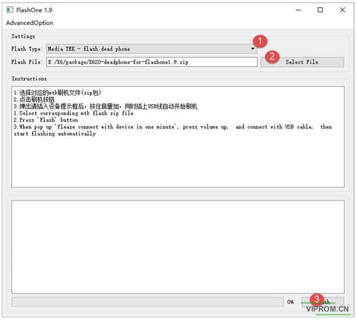**
步骤一：选择刷机方式:Media TEKflash dead phone.
步骤二：升级包选择对应的qfil包X620 deadphone for flashone
步骤三：按住音量上，插入USB线。 （设备管理器出现MTK port）
步骤四：点击开始刷机。第一次刷机需 要解压软件包。
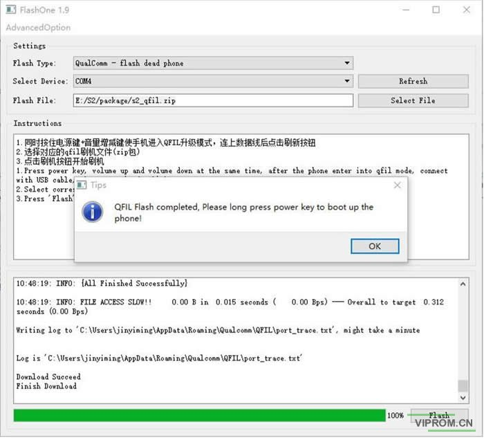

刷机结束，长按开机键开机！

友情提示：QFIL升级结束后，需要 重新使用fastboot方式刷机。