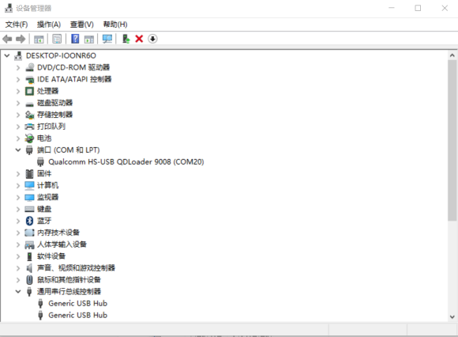
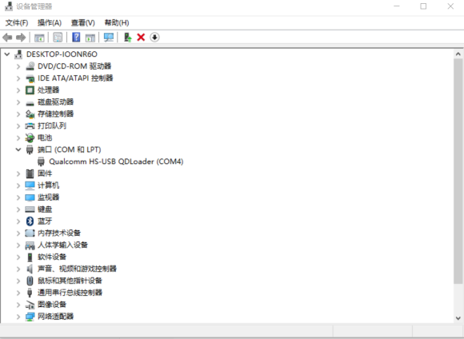
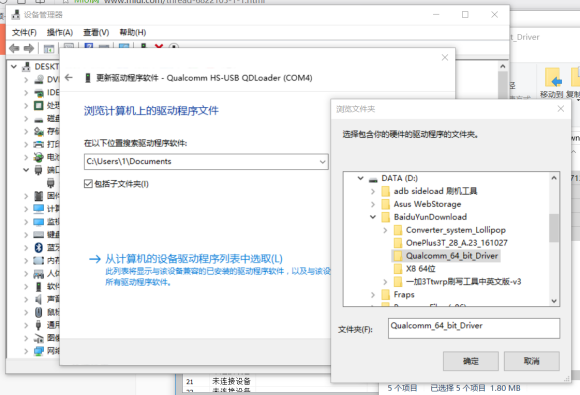
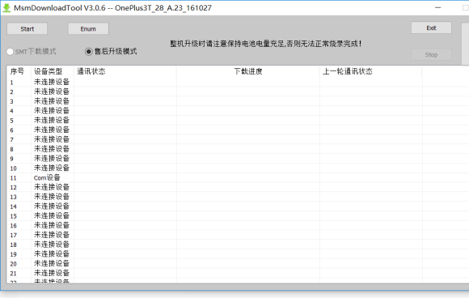
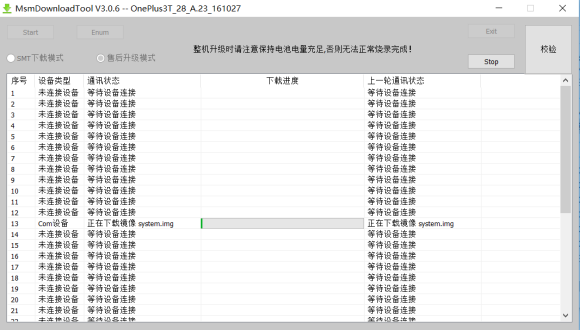
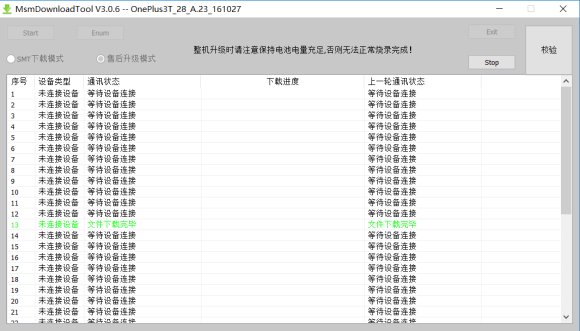
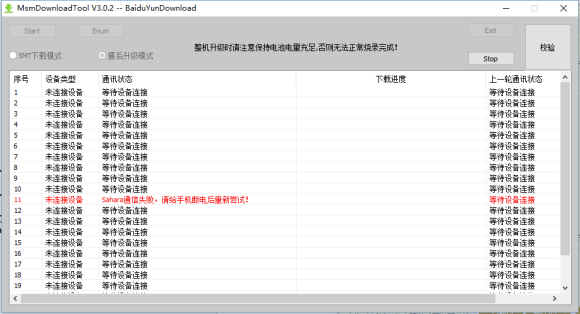

# 一加9008教程--来源百度贴吧

https://tieba.baidu.com/p/4956311345?red_tag=1464141473

##### 9008就是使用高通9008端口进行修复

所有工具可以在工具下载页面进行下载

这里的“黑砖”的意思是：无论按什么按钮，都是黑屏状态，没有开机logo，无法进入fastboot，无法进入recovery,无法使用adb。。。导致黑砖的原因有很多可能，比如刷入了错误的内核、解锁过程导致分区表损坏、没有在系统中打开OEM Unlocking就解锁，或者闲着蛋疼又去上锁。。。。总之不管什么原因（当然除了硬件损坏），黑砖不用怕了，现在都可以挽救回来。

##### 刷机前注意事项：

1、不要用网吧电脑
2、备份所有数据，因为此方法会清空手机所有数据，包括内置储存
3、手机尽量保持足够的电量
4、中途一定不要突然断开

#####  刷机准备：    

1、下载好对应机型刷机包
2、下载好驱动（通用）
3、一条正常的数据线
4、一台正常的电脑

#####  刷机开始：

1、解压刷机包和驱动
2、手机关机，一定要彻底关机。
如果此时手机不能正常开机，长按电源键大概10S就会强制关机，不要按太久否则会自动重启。
**3、手机按住音量+按键至少5S，不要松开同时插入电脑，如果此时电脑有提示声，就可以松开。**
4、打开设备管理器（显示有Qualcomm HS-USB QDloader 9008就行，不一定是COM20，这个是你电脑端口，具体是以你电脑为准）

由于我打开就是9008高通黑砖驱动，所以就不用再安装了。
下面说说不是9008驱动。你可以用一加万能工具箱里面的黑砖驱动

5、安装驱动，如果显示如上图所示，就接着操作，如果已显示9008，请跳过此步骤。
    此时有两种方法：
    方案一：双击Qualcomm_Diag_QD_Loader_2016_driver.exe安装

​    方案二：
——右键那个带感叹号的设备
——更新驱动程序软件
——浏览计算机以查找驱动程序软件
——点浏览选择你解压的驱动目录
——始终安装此驱动程序软件

 如果此时无法安装，请设置电脑——禁用驱动程序签名强制（具体方法百度就有）
6、打开刷机工具，点start刷入就好（不要看图上的软件版本，用包里的）

好了，这样 3T就满血复活了
另外，需要注意救砖刷完的是氧OS自行刷回氢！还有同学可能遇到

**我开始也遇见了，我换了一个USB插口，然后我的驱动因为是自动安装，头一次我直接取消了，不知道是不是这个也是问题，第二次换了插口等它走完就好了。**希望你们一定按照教程！！并祝愿所有小加复生！