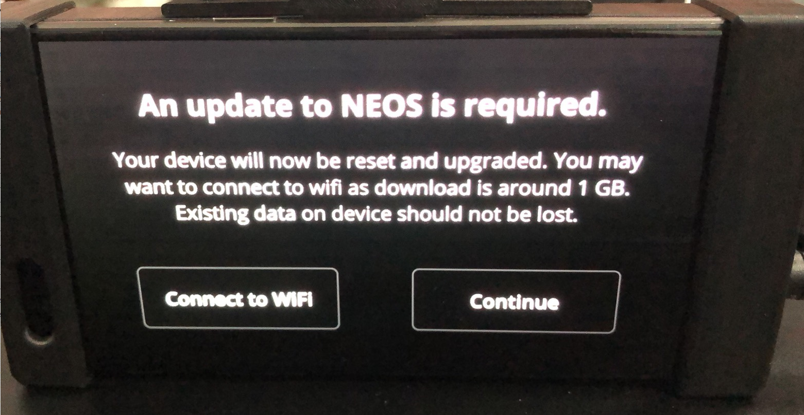
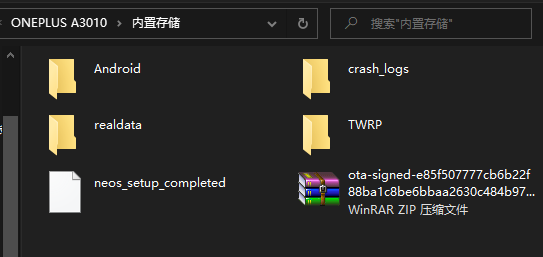
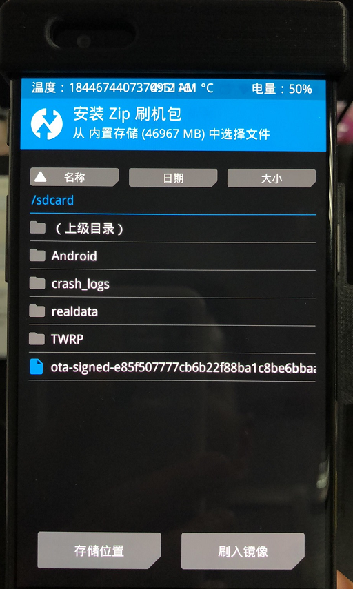
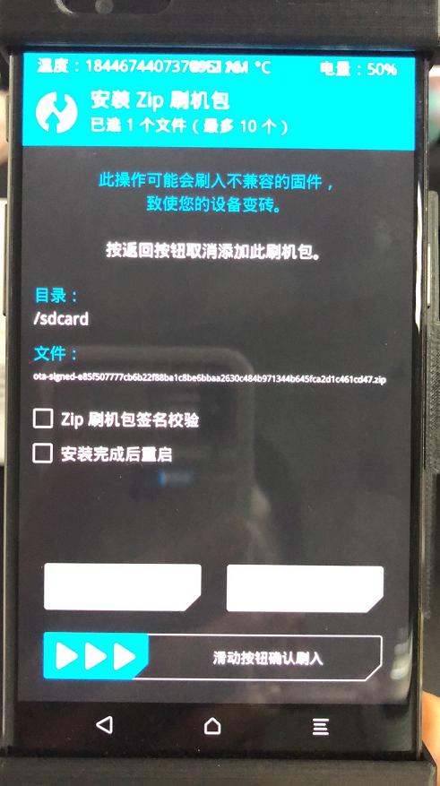
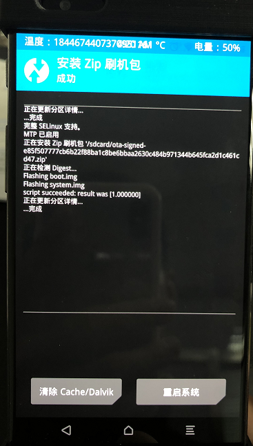

# 手动升级NEOS到NEOS15

op 0.7.10要求升级NEOS版本到neos15
自动升级根据使用者网速决定，如果自动速度较慢的话，可以使用手动升级方法

出现升级提示的时候，不用点击任何选项，采用下面方法可以手动升级

### 1.下载官方升级包

[点击下载system升级包地址](https://commadist.azureedge.net/neosupdate/ota-signed-e85f507777cb6b22f88ba1c8be6bbaa2630c484b971344b645fca2d1c461cd47.zip) 

[点击下载recovery升级包地址](https://commadist.azureedge.net/neosupdate/recovery-db31ffe79dfd60be966fba6d1525a5081a920062b883644dc8f5734bcc6806bb.img) （不想更换recovery可以不下载）

### 2.使用各种方法进行升级包括不限于以下方法

1）使用fastboot语句升级

2）使用twrp，卡刷升级

eon进入twrp，usb链接eon

把第一步下载的zip压缩包和img，传入twrp状态下eon，twrp内选择刷入，不想更换recovery就不用刷入recovery

完成后重启即可

自行选择刷入system升级包或者comma官方推荐的recovery

 

### 3.使用一键升级NEOS15刷机工具升级

[点击下载NEOS15刷机工具](http://wiki.dragonpilot.cn/files/software/一键升级NEOS15修改版.rar)

使用方法：

解压一键升级NEOS15修改版放在桌面

将第一步下载的system升级包解压得到boot.img system.img 

把recovery升级包改名称为recovery.img

然后用把它们三个放到的解压得到的一键升级NEOS15修改版目录中

运行一键NOES仅刷新引导和系统文件.bat

或者

运行一键NOES全刷会清除用户文件和缓存版本.bat

刷机工具内注意两个bat文件

##### 运行一键NOES仅刷新引导和系统文件.bat，将只刷入boot和system

##### 运行一键NOES全刷会清除用户文件和缓存版本.bat，将全刷入所有文件并且格式化用户分区

### 4.使用TRWP备份恢复

下载下面链接

##### DP0710中文版，如果twrp恢复出现错误，请在twrp内格式化之后，用第一步的官方system升级包内镜像重新刷机

https://cloud.189.cn/t/QvQZnmBf2y6b 

按照

[关于TWRP使用的部分说明](about_twrp.md)

[使用 TWRP 恢复 openpilot 备份](cn/how_to_restore_openpilot_backup_via_twrp.md)

进行恢复即可

